# Bootstrap Juju Controller

:::warning
Target Ekseskusi di VM Deployer (172.16.1.3).
:::

### Persiapan Instalasi Juju (Latest)

```bash
# Update sistem
sudo apt update -y

# Inisialisasi LXD dengan konfigurasi default
lxd init --auto

# Masukkan user ke grup lxd agar tidak perlu ketik sudo terus
sudo usermod -aG lxd $USER
newgrp lxd

# Instal Juju (https://github.com/juju/juju/releases)
curl -LO https://github.com/juju/juju/releases/download/v3.6.21/juju-3.6.21-linux-amd64.tar.xz 
tar xf juju-3.6.21-linux-amd64.tar.xz 
sudo install -o root -g root -m 0755 juju /usr/local/bin/juju
```

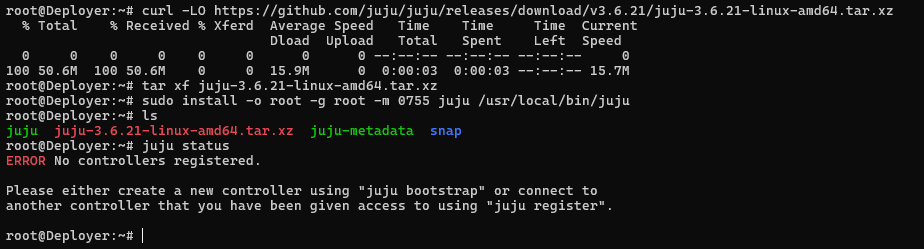

### Set Network Bridge for LXD

```bash
sudo nano /etc/netplan/*.yaml
```

```bash
network:
  version: 2
  ethernets:
    eth0:
      dhcp4: false
    ens19:
      dhcp4: false
    ens20:
      dhcp4: false
    ens21:
      dhcp4: false
    ens22:
      dhcp4: false
      
  bridges:
    br0:
      interfaces: [eth0]
      addresses: [172.16.1.3/24]
      routes:
        - to: default
          via: 172.16.1.1
      nameservers:
        addresses: [8.8.8.8, 1.1.1.1]
      parameters:
        stp: true
        forward-delay: 4

    br1:
      interfaces: [ens19]
      addresses: [172.16.2.3/24]
      parameters:
        stp: true
        forward-delay: 4

    br2:
      interfaces: [ens20]
      addresses: [172.16.3.3/24]
      parameters:
        stp: true
        forward-delay: 4

    br3:
      interfaces: [ens21]
      addresses: [172.16.4.3/24]
      parameters:
        stp: true
        forward-delay: 4

    br4:
      interfaces: [ens22]
      addresses: [172.16.5.3/24]
      parameters:
        stp: true
        forward-delay: 4
```

```bash
sudo netplan try
sudo netplan apply
ip a show br0
```

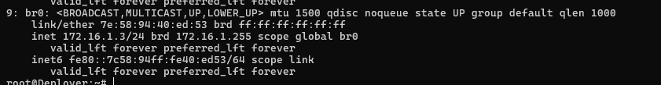

### Bootstrap Juju Controller di Localhost

```bash
# Membuat core Juju di dalam LXD VM Deployer
lxc profile device add default eth0 nic nictype=bridged parent=br0
lxc profile device add default ens19 nic nictype=bridged parent=br1
lxc profile device add default ens20 nic nictype=bridged parent=br2
lxc profile device add default ens21 nic nictype=bridged parent=br3
lxc profile device add default ens22 nic nictype=bridged parent=br4


juju bootstrap localhost juju-controller

lxc list
```

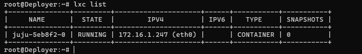

### Enter to lxc/lxd

```bash
lxc exec <lxc-name> -- bash
```

```bash
cat <<EOF > /etc/netplan/99-custom.yaml
network:
  version: 2
  ethernets:
    eth0:
      dhcp4: false
      addresses: [172.16.1.40/24]
    eth1:
      dhcp4: false
      addresses: [172.16.2.40/24]
    eth2:
      dhcp4: false
      addresses: [172.16.3.40/24]
    eth3:
      dhcp4: false
      addresses: [172.16.4.40/24]
    eth4:
      dhcp4: false
      addresses: [172.16.5.40/24]
EOF
```

```bash
netplan apply
```

:::warning
Proses ini akan memakan waktu beberapa menit. Juju akan mengunduh image Ubuntu LXD, membuat container, dan menginstal layanan Juju Controller di dalamnya
:::

### Ambil API Key dari MAAS

:::info
Juju butuh kunci untuk bisa memberikan perintah ke MAAS.
:::

```bash
http://172.16.1.2:5240/MAAS
```

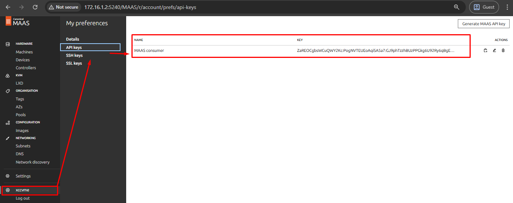

```bash
ZaREOCgbsWCuQWY2Kc:PogNVTEUEoAqiSA5a7:GJ9phTzzhBUzPPGkg6U92Ry6qBgEuyOn
```

### Hubungkan Juju dengan MAAS

Targer → VM Deployer

```bash
juju add-cloud
```

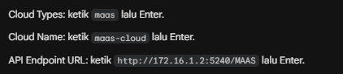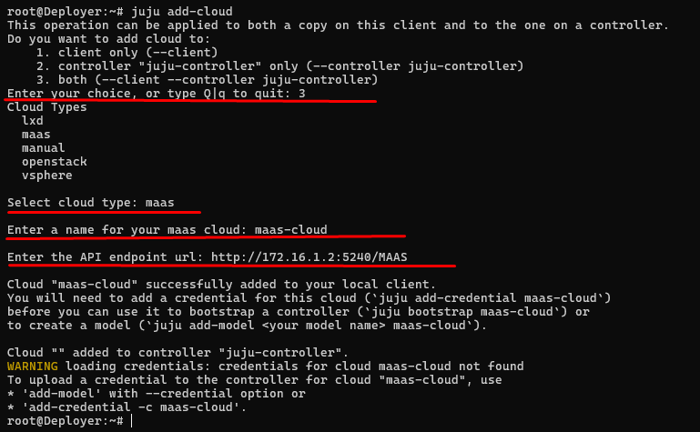

```bash
# masukkan API Key-nya
juju add-credential maas-cloud
```

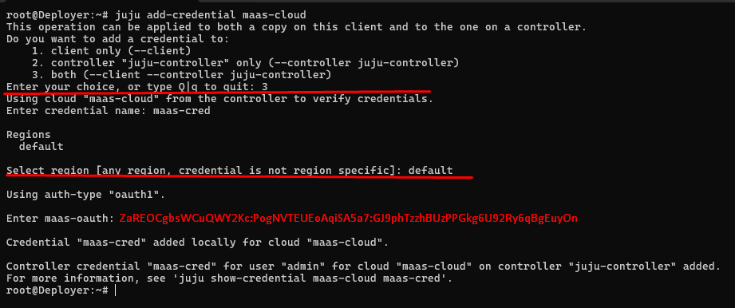

```bash
juju show-credential maas-cloud maas-cred
```

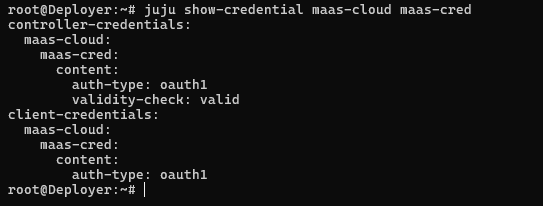

### Buat Model OpenStack

:::info
membuat Model OpenStack, dan menempatkan model ini di atas `maas-cloud`
:::

```bash
juju add-model lab-xccvme maas-cloud/default

# Verifi
juju status
```

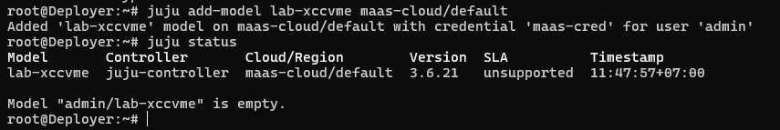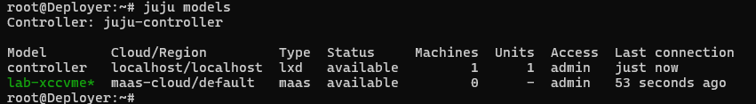

### Verifikasi nama Space

```bash
root@Deployer:~# juju spaces
Name                Space ID  Subnets
alpha               0
management          1         172.16.1.0/24
external-openstack  2         172.16.4.0/24
internal-openstack  3         172.16.2.0/24
storage-network     4         172.16.5.0/24
provider-network    5         172.16.3.0/24
```

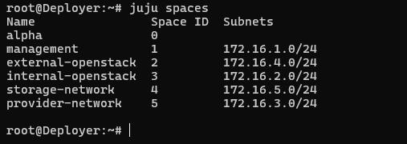

### Set default Space

```bash
juju spaces
juju model-config default-space=management
```

### Set Default OS (Ubuntu 22.04)

```bash
juju model-config default-base=ubuntu@22.04
```

### Set default repo

:::info
http://mirrors.ubuntu.com/ID.txt
:::

```bash
juju model-config apt-mirror=http://kartolo.sby.datautama.net.id/ubuntu
```

### JUJU Cloud init

:::info
Agar machine baru yang dibuat Juju di model akan menjalankan konfigurasi ini saat provisioning.
:::

```bash
nano cloudinit-model.yaml
```

```bash
cloudinit-userdata: |
  #cloud-config
  postruncmd:
    # Timezone Asia/Jakarta
    - timedatectl set-timezone Asia/Jakarta || true

    # NTP via systemd-timesyncd tanpa install paket tambahan
    - mkdir -p /etc/systemd/timesyncd.conf.d
    - |
      cat >/etc/systemd/timesyncd.conf.d/99-lab-ntp.conf <<'EOF'
      [Time]
      NTP=0.id.pool.ntp.org 1.id.pool.ntp.org 2.id.pool.ntp.org 3.id.pool.ntp.org
      FallbackNTP=
      EOF

    - systemctl restart systemd-timesyncd || true
    - timedatectl set-ntp true || true

    # /etc/hosts
    - |
      grep -q "BEGIN OPENSTACK LAB HOSTS" /etc/hosts || cat <<'EOF' >> /etc/hosts
      # BEGIN OPENSTACK LAB HOSTS
      172.16.4.50   horizon-api.projx.my.id
      172.16.4.51   neutron-api.projx.my.id
      172.16.4.52   identity-api.projx.my.id
      172.16.4.53   gnocchi-api.projx.my.id
      172.16.4.54   aodh-api.projx.my.id
      172.16.4.55   ceilometer-api.projx.my.id
      172.16.4.56   cinder-api.projx.my.id
      172.16.4.57   placement-api.projx.my.id
      172.16.4.58   glance-api.projx.my.id
      172.16.4.59   nova-api.projx.my.id
      172.16.4.60   masakari-api.projx.my.id
      172.16.4.61   barbican-api.projx.my.id

      172.16.2.50   neutron-int.projx.my.id
      172.16.2.51   identity-int.projx.my.id
      172.16.2.52   gnocchi-int.projx.my.id
      172.16.2.53   aodh-int.projx.my.id
      172.16.2.54   ceilometer-int.projx.my.id
      172.16.2.55   cinder-int.projx.my.id
      172.16.2.56   placement-int.projx.my.id
      172.16.2.57   glance-int.projx.my.id
      172.16.2.58   nova-int.projx.my.id
      172.16.2.59   masakari-int.projx.my.id
      172.16.2.60   barbican-int.projx.my.id
      172.16.2.61   vault-int.projx.my.id

      172.16.5.50   ceph-mon-01.storage.projx.my.id
      172.16.5.51   ceph-mon-02.storage.projx.my.id
      172.16.5.52   ceph-mon-03.storage.projx.my.id
      # END OPENSTACK LAB HOSTS
      EOF
```

Apply ke model Juju

```bash
juju model-config --file=./cloudinit-model.yaml
```

Verifikasi bahwa config masuk

```bash
juju model-config cloudinit-userdata
```

---

### Update Repo setiap VM/Lxc

:::warning
Hanya jika Repo utama Ubuntu lambat (ubuntu archive)
:::

```bash
cat <<EOF > /etc/apt/sources.list
# REPOSITORY UTAMA (BIZNET GIO - TERCEPAT)
deb http://mirror.biznetgio.com/ubuntu/ jammy main restricted universe multiverse
deb http://mirror.biznetgio.com/ubuntu/ jammy-updates main restricted universe multiverse
deb http://mirror.biznetgio.com/ubuntu/ jammy-backports main restricted universe multiverse
# deb http://mirror.biznetgio.com/ubuntu/ jammy-security main restricted universe multiverse

# REPOSITORY CADANGAN (KARTOLO - SECOND BEST)
deb http://kartolo.sby.datautama.net.id/ubuntu/ jammy main restricted universe multiverse
deb http://kartolo.sby.datautama.net.id/ubuntu/ jammy-updates main restricted universe multiverse
deb http://kartolo.sby.datautama.net.id/ubuntu/ jammy-backports main restricted universe multiverse
# deb http://kartolo.sby.datautama.net.id/ubuntu/ jammy-security main restricted universe multiverse
EOF

# Update untuk menerapkan perubahan
sudo apt clean
sudo rm -rf /var/lib/apt/lists/*
sudo apt update
```

**Next →**