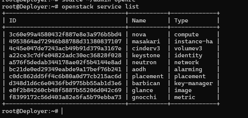
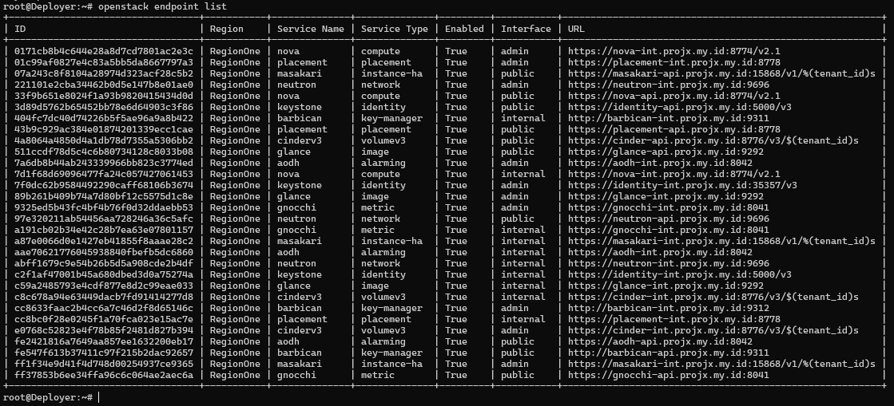
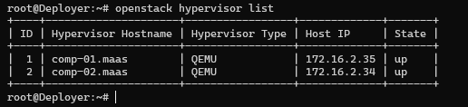
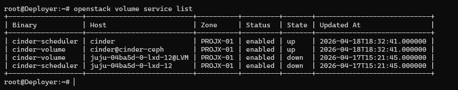
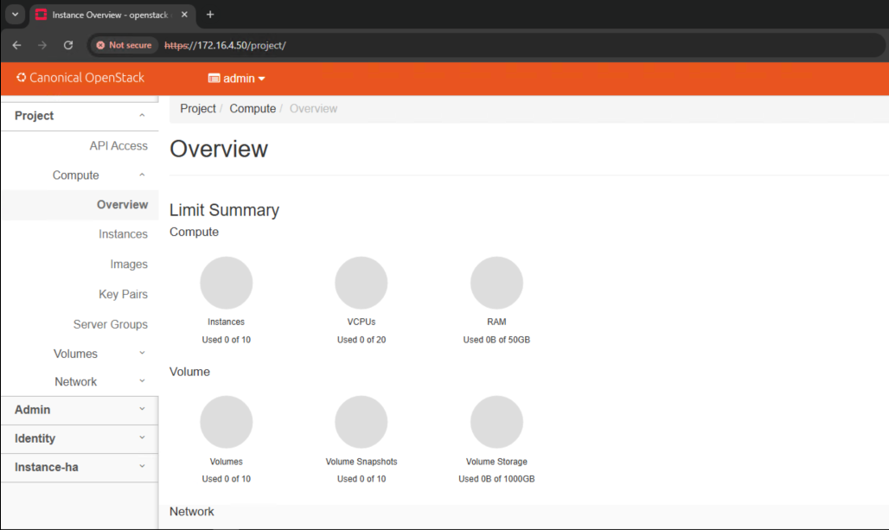

# Client & Admin Dashboard

### Install OpenStack client di Deployer

```bash
apt update
apt install -y python3-openstackclient
```

### Ambil password admin Keystone

:::info
Password admin disimpan oleh charm dan bisa dipakai untuk akses admin cloud.
:::

```bash
juju run --wait keystone/leader get-admin-password
#Atau
juju config keystone admin-password
```

### Buat kredensial admin untuk `openstack` CLI

```bash
mkdir -p /root/openstack-ca
juju run vault/leader get-root-ca | sed -n '/BEGIN CERTIFICATE/,/END CERTIFICATE/p' > /root/openstack-ca/root-ca.pem
sed 's/^  //' /root/openstack-ca/root-ca.pem > /root/openstack-ca/root-ca-fixed.pem
mv /root/openstack-ca/root-ca-fixed.pem /root/openstack-ca/root-ca.pem
chmod 644 /root/openstack-ca/root-ca.pem
```

Verifikasi Sertifikat

```bash
openssl x509 -in /root/openstack-ca/root-ca.pem -text -noout | head
```

```bash
cat > ~/admin-openrc <<'EOF'
export OS_AUTH_URL=https://identity-int.projx.my.id:5000/v3
export OS_USERNAME=admin
export OS_PASSWORD='Kstn-Adm!n-2026-Projx'
export OS_PROJECT_NAME=admin
export OS_USER_DOMAIN_NAME=admin_domain
export OS_PROJECT_DOMAIN_NAME=admin_domain
export OS_IDENTITY_API_VERSION=3
export OS_AUTH_TYPE=password
export OS_REGION_NAME=RegionOne
export OS_CACERT=/root/openstack-ca/root-ca.pem
EOF
```

```
cat > ~/admin-openrc-2 <<'EOF'
export OS_AUTH_URL=https://identity-int.projx.my.id:5000/v3
export OS_USERNAME=admin
export OS_PASSWORD='Kstn-Adm!n-2026-Projx'
export OS_PROJECT_NAME=admin
export OS_USER_DOMAIN_NAME=admin_domain
export OS_PROJECT_DOMAIN_NAME=admin_domain
export OS_IDENTITY_API_VERSION=3
export OS_AUTH_TYPE=password
export OS_REGION_NAME=RegionOne
export OS_CACERT=/root/openstack-ca/root-ca.pem
export OS_INTERFACE=internal
EOF
```

```bash
source ~/admin-openrc
```

### Validasi akses endpoint dan Horizon

```bash
env | grep '^OS_'
openstack endpoint list
openstack service list
openstack catalog list
```



### Verifikasi resource dasar tenant

```bash
openstack image list
openstack flavor list
openstack network list
openstack subnet list
openstack router list
openstack hypervisor list
openstack volume service list
```



### Kredensial admin untuk login Horizon

:::info
- **User Name**: `admin`
- **Password**: password admin Keystone (juju run --wait keystone/leader get-admin-password)
- **Domain**: `admin_domain`
:::

```bash
https://172.16.4.50/

https://horizon-api.projx.my.id/
```



**Next →**