# Deployment Charm

Target Eksekusi: VM Deployer

:::warning
Kondisi NODE/VM Ready
:::

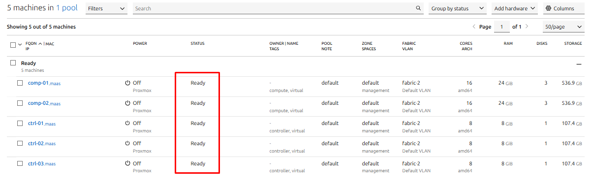

### Request Mesin berdasarkan Tag

```bash
juju add-machine -n 3 --constraints "tags=controller" --base ubuntu@22.04

juju add-machine -n 2 --constraints "tags=compute" --base ubuntu@22.04
```

:::success
Jika berhasil, Juju akan mengeluarkan output seperti `created machine 0, 1, 2` dan `created machine 3, 4`(Sesuai jumlah Node)
:::

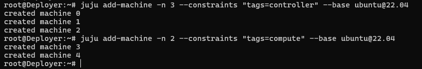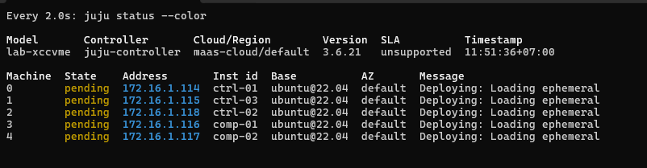

```bash
http://172.16.1.2:5240/MAAS/r/machines
```

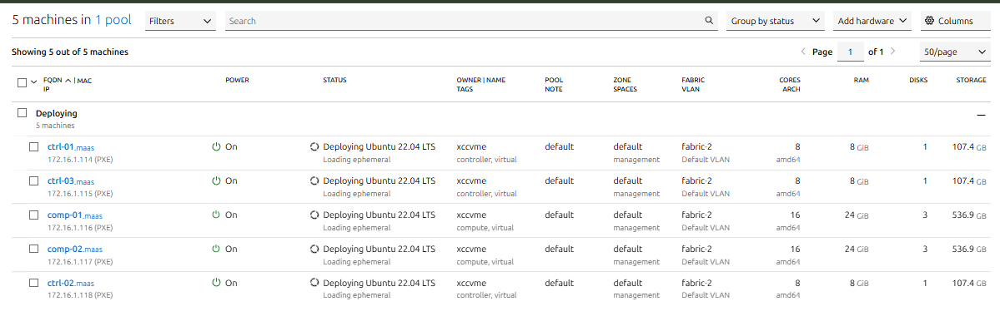

### Machine Ready

```bash
watch -c juju status --color

# juju machines
```

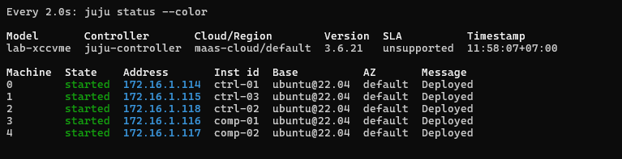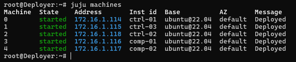
<details>
<summary>Remove all machine and model</summary>

```bash
juju destroy-model lab-xccvme --destroy-storage --force

juju remove-machine 0 1 2 3 4 --force

# remove aplication
#juju remove-application <app-name> --force
juju remove-application mysql-innodb-cluster --force
```

</details>

### YAML CARACAL (2024.1/stabel)

```bash
nano openstack-caracal.yaml
```

:::warning
ITEM YANG HARUS DISESUAIKAN:

- Keystone→ admin-password: sesuaikan !
- ha-masakari → maas_credentials : Ganti dengan api-key MAAS
- openstack-dashboard→ secret : sesuakan paasword
- ha-masakari → cluster_count: 3 (sesuai jumlah controller).
- data-port: br-provider:ens20 pada `neutron-gateway` dan `neutron-openvswitch (Sesuaikan NIC fisik Spaces|`provider-network`, cek by ip a)`
- `ceph-mon expected-osd-count: 4 (Sesuai total OSD)`
:::

```bash
barbican:
  action-managed-upgrade: false
  hmac-key-length: 32
  openstack-origin: caracal
  os-admin-network: 172.16.2.0/24
  os-internal-network: 172.16.2.0/24
  os-public-network: 172.16.4.0/24
  os-admin-hostname: barbican-int.projx.my.id
  os-internal-hostname: barbican-int.projx.my.id
  os-public-hostname: barbican-api.projx.my.id
  region: RegionOne
  use-internal-endpoints: true
  vip: 172.16.4.61 172.16.2.60

vault:
  hostname: vault-int.projx.my.id
  auto-generate-root-ca-cert: true
  default-ttl: 8759h
  max-ttl: 87600h
  disable-mlock: false
  totally-unsecure-auto-unlock: false
  vip: 172.16.2.61

masakari:
  action-managed-upgrade: false
  openstack-origin: caracal
  evacuate-all-instances: false
  os-data-network: 172.16.2.0/24
  os-admin-network: 172.16.2.0/24
  os-internal-network: 172.16.2.0/24
  os-public-network: 172.16.4.0/24
  os-public-hostname: masakari-api.projx.my.id
  os-internal-hostname: masakari-int.projx.my.id
  os-admin-hostname: masakari-int.projx.my.id
  region: RegionOne
  use-internal-endpoints: true
  vip: 172.16.4.60 172.16.2.59

ha-masakari:
  cluster_count: 3
  maas_url: http://172.16.1.2:5240/MAAS
  maas_credentials: ZaREOCgbsWCuQWY2Kc:PogNVTEUEoAqiSA5a7:GJ9phTzzhBUzPPGkg6U92Ry6qBgEuyOn
  stonith_enabled: "False"

pacemaker-remote:
  enable-stonith: true
  enable-resources: false

memcached:
  allow-ufw-ip6-softfail: true
  connection-limit: 10240

aodh:
  action-managed-upgrade: false
  openstack-origin: caracal
  os-public-hostname: aodh-api.projx.my.id
  os-internal-hostname: aodh-int.projx.my.id
  os-admin-hostname: aodh-int.projx.my.id
  os-admin-network: 172.16.2.0/24
  os-internal-network: 172.16.2.0/24
  os-public-network: 172.16.4.0/24
  region: RegionOne
  use-internal-endpoints: true
  vip: 172.16.4.54 172.16.2.53

gnocchi:
  action-managed-upgrade: false
  openstack-origin: caracal
  os-public-hostname: gnocchi-api.projx.my.id
  os-internal-hostname: gnocchi-int.projx.my.id
  os-admin-hostname: gnocchi-int.projx.my.id
  os-admin-network: 172.16.2.0/24
  os-internal-network: 172.16.2.0/24
  os-public-network: 172.16.4.0/24
  region: RegionOne
  storage-backend: ceph
  use-internal-endpoints: true
  vip: 172.16.4.53 172.16.2.52

ceilometer:
  action-managed-upgrade: false
  gnocchi-archive-policy: high
  openstack-origin: caracal
  os-public-hostname: ceilometer-api.projx.my.id
  os-internal-hostname: ceilometer-int.projx.my.id
  os-admin-hostname: ceilometer-int.projx.my.id
  os-admin-network: 172.16.2.0/24
  os-internal-network: 172.16.2.0/24
  os-public-network: 172.16.4.0/24
  region: RegionOne
  use-internal-endpoints: true
  vip: 172.16.4.55 172.16.2.54

cinder:
  action-managed-upgrade: false
  api-listening-port: 8776
  audit-middleware: true
  block-device: none
  config-flags: storage_availability_zone=PROJX-01
  default-volume-type: ceph-01
  enabled-services: all
  image-volume-cache-enabled: true
  openstack-origin: caracal
  os-public-hostname: cinder-api.projx.my.id
  os-internal-hostname: cinder-int.projx.my.id
  os-admin-hostname: cinder-int.projx.my.id
  os-admin-network: 172.16.2.0/24
  os-internal-network: 172.16.2.0/24
  os-public-network: 172.16.4.0/24
  prefer-ipv6: false
  region: RegionOne
  use-internal-endpoints: true
  vip: 172.16.4.56 172.16.2.55

cinder-ceph:
  backend-availability-zone: PROJX-01
  volume-backend-name: ceph-01
  rbd-pool-name: cinder-ceph

placement:
  action-managed-upgrade: false
  openstack-origin: caracal
  os-public-hostname: placement-api.projx.my.id
  os-internal-hostname: placement-int.projx.my.id
  os-admin-hostname: placement-int.projx.my.id
  os-admin-network: 172.16.2.0/24
  os-internal-network: 172.16.2.0/24
  os-public-network: 172.16.4.0/24
  region: RegionOne
  use-internal-endpoints: true
  vip: 172.16.4.57 172.16.2.56

openstack-dashboard:
  action-managed-upgrade: false
  allow-password-autocompletion: true
  cinder-backup: false
  default-create-volume: false
  default-domain: admin_domain
  disable-password-reveal: false
  dropdown-max-items: 50
  enable-fip-topology-check: true
  enable-router-panel: true
  endpoint-type: publicURL
  webroot: /
  enforce-password-check: true
  enforce-ssl: false
  help-url: https://docs.openstack.org/project-deploy-guide/charm-deployment-guide/latest/
  hide-create-volume: false
  image-formats: iso ova qcow2 raw vmdk
  neutron-network-dvr: true
  neutron-network-firewall: true
  neutron-network-l3ha: true
  neutron-network-lb: false
  openstack-origin: caracal
  os-public-hostname: horizon-api.projx.my.id
  prefer-ipv6: false
  secret: "Hzn$ecret-2026-Projx-x9F2vM8qL4pT7nK"
  session-timeout: 1800
  site-branding: openstack canonical
  site-branding-link: https://projx.my.id/
  use-internal-endpoints: false
  vip: 172.16.4.50
  worker-multiplier: 0.1

glance:
  action-managed-upgrade: false
  rbd-pool-name: glance
  expose-image-locations: true
  restrict-ceph-pools: false
  disk-formats: vmdk,raw,qcow2,iso
  image-conversion: true
  openstack-origin: caracal
  os-admin-hostname: glance-int.projx.my.id
  os-internal-hostname: glance-int.projx.my.id
  os-public-hostname: glance-api.projx.my.id
  os-admin-network: 172.16.2.0/24
  os-internal-network: 172.16.2.0/24
  os-public-network: 172.16.4.0/24
  prefer-ipv6: false
  region: RegionOne
  use-internal-endpoints: true
  vip: 172.16.4.58 172.16.2.57

neutron-api:
  action-managed-upgrade: false
  allow-automatic-dhcp-failover: true
  allow-automatic-l3agent-failover: true
  default-tenant-network-type: vxlan
  dhcp-agents-per-network: 3
  dhcp-load-type: networks
  dns-domain: projx.my.id
  enable-dvr: true
  enable-l3ha: true
  enable-ml2-port-security: true
  flat-network-providers: physnet1
  global-physnet-mtu: 1500
  l2-population: true
  manage-neutron-plugin-legacy-mode: true
  min-l3-agents-per-router: 1
  max-l3-agents-per-router: 2
  neutron-plugin: ovs
  neutron-security-groups: true
  openstack-origin: caracal
  os-admin-hostname: neutron-int.projx.my.id
  os-public-hostname: neutron-api.projx.my.id
  os-internal-hostname: neutron-int.projx.my.id
  os-admin-network: 172.16.2.0/24
  os-internal-network: 172.16.2.0/24
  os-public-network: 172.16.4.0/24
  overlay-network-type: vxlan
  path-mtu: 1500
  prefer-ipv6: false
  quota-floatingip: 25
  quota-network: 15
  quota-pool: 15
  quota-port: 75
  quota-router: 5
  quota-security-group: 20
  quota-security-group-rule: 200
  quota-subnet: 15
  quota-vip: 10
  region: RegionOne
  router-scheduler-driver: neutron.scheduler.l3_agent_scheduler.AZLeastRoutersScheduler
  use-internal-endpoints: true
  vni-ranges: 1:5000
  vip: 172.16.4.51 172.16.2.50
  worker-config-multiplier: 0.05

neutron-gateway:
  action-managed-upgrade: false
  bridge-mappings: physnet1:br-provider
  data-port: br-provider:ens20
  default-availability-zone: PROJX-01
  disable-neutron-lbaas: true
  dns-servers: 8.8.8.8,8.8.4.4,1.1.1.1
  enable-auto-restarts: true
  enable-isolated-metadata: true
  enable-l3-agent: true
  firewall-driver: openvswitch
  flat-network-providers: physnet1
  instance-mtu: 1500
  openstack-origin: caracal
  os-data-network: 172.16.2.0/24
  ovs-use-veth: "true"
  plugin: ovs
  run-internal-router: none

neutron-openvswitch:
  bridge-mappings: physnet1:br-provider
  data-port: br-provider:ens20
  disable-security-groups: false
  dns-servers: 8.8.8.8,8.8.4.4,1.1.1.1
  enable-auto-restarts: true
  enable-local-dhcp-and-metadata: false
  firewall-driver: openvswitch
  flat-network-providers: physnet1
  instance-mtu: 1500
  os-data-network: 172.16.2.0/24
  ovs-use-veth: "true"
  prevent-arp-spoofing: true
  use-dvr-snat: true

nova-cloud-controller:
  action-managed-upgrade: false
  allow-resize-to-same-host: true
  cache-known-hosts: true
  console-access-protocol: novnc
  console-keymap: en-us
  cpu-allocation-ratio: 5.0
  database: nova
  database-user: nova
  disk-allocation-ratio: 1.0
  enable-isolated-aggregate-filtering: true
  enable-new-services: true
  network-manager: Neutron
  openstack-origin: caracal
  os-admin-hostname: nova-int.projx.my.id
  os-public-hostname: nova-api.projx.my.id
  os-internal-hostname: nova-int.projx.my.id
  os-admin-network: 172.16.2.0/24
  os-internal-network: 172.16.2.0/24
  os-public-network: 172.16.4.0/24
  use-internal-endpoints: true
  prefer-ipv6: false
  quota-instances: 10
  quota-key-pairs: 10
  quota-ram: 51200
  ram-allocation-ratio: 1.00
  region: RegionOne
  scheduler-max-attempts: 5
  service-guard: true
  vip: 172.16.4.59 172.16.2.58

nova-compute:
  skip-cpu-compare-at-startup: true
  skip-cpu-compare-on-dest: true
  action-managed-upgrade: false
  live-migration-permit-post-copy: false
  live-migration-permit-auto-converge: false
  cpu-allocation-ratio: 5.0
  default-availability-zone: PROJX-01
  default-ephemeral-format: ext4
  disk-allocation-ratio: 2.0
  enable-live-migration: true
  enable-resize: true
  inject-password: false
  libvirt-image-backend: qcow2
  libvirt-migration-network: 172.16.2.0/24
  migration-auth-type: ssh
  openstack-origin: caracal
  os-internal-network: 172.16.2.0/24
  prefer-ipv6: false
  ram-allocation-ratio: 1.00
  reserved-host-memory: 8192
  use-internal-endpoints: true
  virt-type: kvm
  virtio-net-rx-queue-size: 1024
  virtio-net-tx-queue-size: 1024

mysql-innodb-cluster:
  binlogs-expire-days: 30
  innodb-buffer-pool-size: 256M
  binlogs-max-size: 256M
  binlogs-path: /var/log/mysql/mysql-bin.log
  cluster-name: projxMySQL
  enable-binlogs: true
  innodb-file-per-table: true
  max-connections: 100000
  prefer-ipv6: false
  source: distro
  tuning-level: safest

rabbitmq-server:
  cluster-partition-handling: ignore
  access-network: 172.16.2.0/24
  cluster-network: 172.16.2.0/24
  enable-auto-restarts: true
  management_plugin: true
  prefer-ipv6: false
  min-cluster-size: 3

keystone:
  action-managed-upgrade: false
  admin-password: "Kstn-Adm!n-2026-Projx"
  database: keystone
  database-user: keystone
  identity-backend: sql
  openstack-origin: caracal
  os-admin-network: 172.16.2.0/24
  os-internal-network: 172.16.2.0/24
  os-admin-hostname: identity-int.projx.my.id
  os-internal-hostname: identity-int.projx.my.id
  os-public-hostname: identity-api.projx.my.id
  os-public-network: 172.16.4.0/24
  prefer-ipv6: false
  preferred-api-version: 3
  region: RegionOne
  use-syslog: true
  token-expiration: 3600
  token-provider: fernet
  vip: 172.16.4.52 172.16.2.51
  worker-config-multiplier: 0.05

ceph-mon:
  source: cloud:jammy-caracal
  monitor-count: 3
  expected-osd-count: 4
  auth-supported: cephx
  ceph-public-network: 172.16.5.0/24
  ceph-cluster-network: 172.16.5.0/24

ceph-osd:
  source: cloud:jammy-caracal
  osd-devices: /dev/sdb /dev/sdc
```

### 1\. Database (Mysql 8)

```bash
juju deploy -n 3 \
  --to lxd:0,lxd:1,lxd:2 \
  --constraints spaces=internal-openstack \
  --channel 8.0/stable \
  --config openstack-caracal.yaml \
  mysql-innodb-cluster
```

### 2\. RabbitMq

```bash
juju deploy -n 3 \
  --to lxd:0,lxd:1,lxd:2 \
  --constraints spaces=internal-openstack \
  --channel 3.9/stable \
  --config openstack-caracal.yaml \
  rabbitmq-server
```

### 3\. Keystone

```bash
juju deploy -n 3 \
  --to lxd:0,lxd:1,lxd:2 \
  --constraints spaces=internal-openstack,external-openstack,storage-network \
  --channel 2024.1/stable \
  --config openstack-caracal.yaml \
  keystone
```

Deploy HA subordinate

```arduino
juju deploy --config cluster_count=3 hacluster ha-keystone
```

Deploy MySQL Router

```bash
juju deploy --channel 8.0/stable mysql-router keystone-mysql-router
```

Relasi

```bash
juju integrate ha-keystone:ha keystone:ha
juju integrate keystone-mysql-router:db-router mysql-innodb-cluster:db-router
juju integrate keystone-mysql-router:shared-db keystone:shared-db
```

### 4\. Neutron-API

```bash
juju deploy -n 3 \
  --to lxd:0,lxd:1,lxd:2 \
  --constraints spaces=internal-openstack,external-openstack,storage-network \
  --channel 2024.1/stable \
  --config openstack-caracal.yaml \
  neutron-api
```

Deploy `hacluster` untuk `neutron-api`

```bash
juju deploy --config cluster_count=3 hacluster ha-neutron-api
```

Deploy `neutron-gateway` di 3 controller

```bash
juju deploy -n 3 \
  --to 0,1,2 \
  --channel 2024.1/stable \
  --config openstack-caracal.yaml \
  neutron-gateway
```

Deploy `neutron-openvswitch`

```bash
juju deploy \
  --channel 2024.1/stable \
  --config openstack-caracal.yaml \
  neutron-openvswitch
```

Deploy `mysql-router` untuk `neutron-api`

```bash
juju deploy --channel 8.0/stable mysql-router neutron-api-mysql-router
```

Relasi

```bash
juju integrate ha-neutron-api:ha neutron-api:ha
juju integrate neutron-api neutron-openvswitch
juju integrate keystone:identity-service neutron-api:identity-service
juju integrate neutron-api-mysql-router:shared-db neutron-api:shared-db
juju integrate neutron-api-mysql-router:db-router mysql-innodb-cluster:db-router
juju integrate neutron-gateway:amqp rabbitmq-server:amqp
juju integrate neutron-openvswitch rabbitmq-server
juju integrate neutron-api:amqp rabbitmq-server:amqp
```

### 5\. Glance

```bash
juju deploy -n 3 \
  --to lxd:0,lxd:1,lxd:2 \
  --constraints spaces=internal-openstack,external-openstack,storage-network \
  --channel 2024.1/stable \
  --config openstack-caracal.yaml \
  glance

juju deploy --channel 8.0/stable mysql-router glance-mysql-router
juju deploy --config cluster_count=3 hacluster ha-glance
```

Relasi

```bash
juju integrate ha-glance:ha glance:ha
juju integrate glance-mysql-router:shared-db glance:shared-db
juju integrate glance-mysql-router:db-router mysql-innodb-cluster:db-router
juju integrate glance:identity-service keystone:identity-service
juju integrate glance:amqp rabbitmq-server:amqp
```

### 6\. Nova

Deploy `nova-compute` ke 2 compute node

```bash
juju deploy -n 2 \
  --to 3,4 \
  --channel 2024.1/stable \
  --config openstack-caracal.yaml \
  nova-compute
```

Deploy `nova-cloud-controller` ke 3 controller LXD

```bash
juju deploy -n 3 \
  --to lxd:0,lxd:1,lxd:2 \
  --constraints spaces=internal-openstack,external-openstack \
  --channel 2024.1/stable \
  --config openstack-caracal.yaml \
  nova-cloud-controller
```

Deploy HA subordinate

```bash
juju deploy --config cluster_count=3 hacluster ha-nova-cloud-controller
```

Deploy MySQL Router

```bash
juju deploy --channel 8.0/stable mysql-router ncc-mysql-router
```

Relasi

```bash
juju integrate neutron-openvswitch nova-compute
juju integrate rabbitmq-server:amqp nova-compute:amqp
juju integrate glance:image-service nova-compute:image-service

juju integrate nova-cloud-controller:ha ha-nova-cloud-controller:ha
juju integrate ncc-mysql-router:db-router mysql-innodb-cluster:db-router
juju integrate ncc-mysql-router:shared-db nova-cloud-controller:shared-db
juju integrate nova-cloud-controller:identity-service keystone:identity-service
juju integrate nova-cloud-controller:amqp rabbitmq-server:amqp
juju integrate nova-cloud-controller:neutron-api neutron-api:neutron-api
juju integrate nova-cloud-controller:cloud-compute nova-compute:cloud-compute
juju integrate glance:image-service nova-cloud-controller:image-service
juju integrate neutron-gateway nova-cloud-controller
juju integrate neutron-gateway:neutron-plugin-api neutron-api:neutron-plugin-api
```

### 7\. Placement

Deploy `placement`

```bash
juju deploy -n 3 \
  --to lxd:0,lxd:1,lxd:2 \
  --constraints spaces=internal-openstack,external-openstack \
  --channel 2024.1/stable \
  --config openstack-caracal.yaml \
  placement
```

Deploy `placement-mysql-router`

```bash
juju deploy --channel 8.0/stable mysql-router placement-mysql-router
```

Deploy `hacluster` untuk Placement

```bash
juju deploy --config cluster_count=3 hacluster ha-placement
```

Relasi Placement

```bash
juju integrate placement:ha ha-placement:ha
juju integrate placement-mysql-router:shared-db placement:shared-db
juju integrate placement-mysql-router:db-router mysql-innodb-cluster:db-router
juju integrate placement:identity-service keystone:identity-service
juju integrate placement:placement nova-cloud-controller:placement
```

### 8\. Memcache

```bash
juju deploy -n 3 \
  --to lxd:0,lxd:1,lxd:2 \
  --constraints spaces=internal-openstack \
  --channel latest/stable \
  --config openstack-caracal.yaml \
  memcached
```

Relasi nova-cloud-controller

```bash
juju integrate nova-cloud-controller:memcache memcached:cache
```

### 9\. Ceph Mon & Ceph OSD

:::warning
Hanya jika backend ceph di conpute node (misal ini sdb sdc), Jika menggunakan Cluster ceph External Skip saja.
:::

```bash
juju deploy -n 3 \
  --to 0,1,2 \
  --channel reef/stable \
  --config openstack-caracal.yaml \
  ceph-mon
```

```bash
juju deploy -n 2 \
  --to 3,4 \
  --channel reef/stable \
  --config openstack-caracal.yaml \
  ceph-osd
```

Relasi

```bash
juju integrate ceph-osd:mon ceph-mon:osd
```

### 10\. Cinder

```bash
juju deploy -n 3 \
  --to lxd:0,lxd:1,lxd:2 \
  --constraints spaces=internal-openstack,external-openstack,storage-network \
  --channel 2024.1/stable \
  --config openstack-caracal.yaml \
  cinder
```

Deploy `cinder-mysql-router`

```bash
juju deploy --channel 8.0/stable mysql-router cinder-mysql-router
```

Deploy `ha-cinder`

```bash
juju deploy --config cluster_count=3 hacluster ha-cinder
```

Deploy `cinder-ceph`

```bash
juju deploy --channel 2024.1/stable --config openstack-caracal.yaml cinder-ceph
```

Relasi

```bash
juju integrate ha-cinder:ha cinder:ha
juju integrate cinder-mysql-router:db-router mysql-innodb-cluster:db-router
juju integrate cinder-mysql-router:shared-db cinder:shared-db
juju integrate cinder:cinder-volume-service nova-cloud-controller:cinder-volume-service
juju integrate cinder:identity-service keystone:identity-service
juju integrate cinder:amqp rabbitmq-server:amqp
juju integrate cinder:image-service glance:image-service
juju integrate nova-compute:ceph-access cinder-ceph:ceph-access

# Relasi ceph-mon dan ceph-osd
juju integrate cinder-ceph:storage-backend cinder:storage-backend
juju integrate cinder-ceph:ceph ceph-mon:client
```

### 11\. Ceph Proxy

:::warning
Hanya jalankan kalau Menggunakan cluster Ceph External, Kalau internal di node Compute Skip ini.
:::

```bash
# ceph-proxy.yaml
ceph-proxy:
  fsid: "REPLACE_CEPH_FSID"
  admin-key: "REPLACE_CEPH_ADMIN_KEY_BASE64"
  monitor-hosts: "172.16.5.50 172.16.5.51 172.16.5.52"
```

```bash
juju deploy \
  --to lxd:0 \
  --constraints spaces=storage-network,internal-openstack \
  --channel reef/stable \
  --config ceph-proxy.yaml \
  ceph-proxy
```

```bash
juju integrate ceph-proxy:client glance:ceph
juju integrate cinder-ceph:ceph ceph-proxy:client
juju integrate cinder-ceph:storage-backend cinder:storage-backend
juju integrate cinder-ceph:ceph-access nova-compute:ceph-access
```

### 12\. Horizon Dashboard

```bash
juju deploy -n 3 \
  --to lxd:0,lxd:1,lxd:2 \
  --constraints spaces=internal-openstack,external-openstack \
  --channel 2024.1/stable \
  --config openstack-caracal.yaml \
  openstack-dashboard
```

Deploy `hacluster` untuk Horizon

```bash
juju deploy --config cluster_count=3 hacluster ha-openstack-dashboard
```

Relasi yang dibutuhkan

```bash
juju integrate ha-openstack-dashboard:ha openstack-dashboard:ha
juju integrate openstack-dashboard:identity-service keystone:identity-service
```

### 13\. Aodh

```bash
juju deploy -n 3 \
  --to lxd:0,lxd:1,lxd:2 \
  --constraints spaces=internal-openstack,external-openstack \
  --channel 2024.1/stable \
  --config openstack-caracal.yaml \
  aodh
```

```bash
juju deploy --config cluster_count=3 hacluster ha-aodh
juju deploy --channel 8.0/stable mysql-router aodh-mysql-router
```

Relasi

```bash
juju integrate aodh:ha ha-aodh:ha
juju integrate aodh-mysql-router:shared-db aodh:shared-db
juju integrate aodh-mysql-router:db-router mysql-innodb-cluster:db-router
juju integrate aodh:amqp rabbitmq-server:amqp
juju integrate aodh:identity-service keystone:identity-service
```

### 14\. Genocchi

```bash
juju deploy -n 3 --to lxd:0,lxd:1,lxd:2 --constraints spaces=internal-openstack,external-openstack,storage-network  --channel 2024.1/stable --config openstack-caracal.yaml gnocchi gnocchi
```

```bash
juju deploy --channel 8.0/stable mysql-router gnocchi-mysql-router
```

```bash
juju integrate gnocchi:shared-db gnocchi-mysql-router:shared-db
juju integrate gnocchi-mysql-router:db-router mysql-innodb-cluster:db-router
juju integrate gnocchi:identity-service keystone:identity-service
juju integrate gnocchi:coordinator-memcached memcached:cache
juju integrate gnocchi:storage-ceph ceph-mon:client

# relasi jika ceph proxy aktif
juju integrate gnocchi:storage-ceph ceph-proxy:client
```

Tambahkan HA setelah principal app sudah seha

```bash
juju deploy --config cluster_count=3 hacluster ha-gnocchi
```

```bash
juju integrate gnocchi:ha ha-gnocchi:ha
```

### 15\. Ceilometer

```bash
juju deploy -n 3 \
  --to lxd:0,lxd:1,lxd:2 \
  --constraints spaces=internal-openstack,external-openstack \
  --channel 2024.1/stable \
  --config openstack-caracal.yaml \
  ceilometer
```

Deploy `hacluster` untuk Ceilometer

```bash
juju deploy --config cluster_count=3 hacluster ha-ceilometer
```

Relasi

```bash
juju integrate ceilometer:ha ha-ceilometer:ha
juju integrate ceilometer:amqp rabbitmq-server:amqp
juju integrate ceilometer:identity-service keystone:identity-service
juju integrate ceilometer:identity-notifications keystone:identity-notifications
juju integrate ceilometer:identity-credentials keystone:identity-credentials
juju integrate ceilometer:metric-service gnocchi:metric-service
```

Jalankan upgrade database Ceilometer

:::warning
Setelah relasi sudah masuk dan unit leader siap
:::

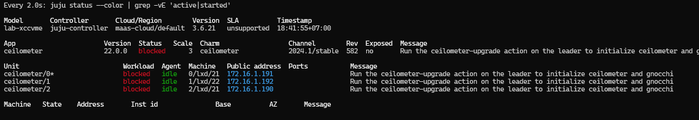

```bash
juju run ceilometer/leader ceilometer-upgrade
```

Deploy `ceilometer-agent`

```bash
juju deploy --channel 2024.1/stable ceilometer-agent
```

```bash
juju integrate ceilometer-agent:nova-ceilometer nova-compute:nova-ceilometer
juju integrate ceilometer-agent:amqp rabbitmq-server:amqp
juju integrate ceilometer:ceilometer-service ceilometer-agent:ceilometer-service
```

### 16\. Masakari

```bash
juju deploy -n 3 \
  --to lxd:0,lxd:1,lxd:2 \
  --constraints spaces=internal-openstack,external-openstack \
  --channel 2024.1/stable \
  --config openstack-caracal.yaml \
  masakari
```

Deploy `hacluster` untuk Masakari

```bash
juju deploy --config cluster_count=3 hacluster ha-masakari
```

Deploy `mysql-router` untuk Masakari

```bash
juju deploy --channel 8.0/stable mysql-router masakari-mysql-router
```

Relasi

```bash
juju integrate masakari:ha ha-masakari:ha
juju integrate masakari-mysql-router:shared-db masakari:shared-db
juju integrate masakari-mysql-router:db-router mysql-innodb-cluster:db-router
juju integrate masakari:amqp rabbitmq-server:amqp
juju integrate masakari:identity-service keystone:identity-service
```

**Masakari monitors**

```bash
juju deploy --channel 2024.1/stable masakari-monitors
```

Relasikan ke Keystone dan Nova Compute

```bash
juju integrate masakari-monitors nova-compute
```

**Pacemaker remote untuk compute**

```bash
juju deploy --channel jammy/stable pacemaker-remote
```

Relasikan ke compute dan HA Masakari

```bash
juju integrate pacemaker-remote nova-compute
juju integrate ha-masakari:pacemaker-remote pacemaker-remote:pacemaker-remote
juju integrate masakari-monitors:identity-credentials keystone:identity-credentials
```

**Aktifkan scheduler filter di Nova**

:::info
Masakari butuh ini di `nova-cloud-controller`
:::

```bash
juju config nova-cloud-controller enable-isolated-aggregate-filtering=true
```

**Install dashboard Masakari di Horizon**

Plugin paket OS di semua unit `openstack-dashboard (Sesuaikan ID)`

```bash
for i in 0 1 2; do
  juju ssh openstack-dashboard/$i "sudo apt purge -y python3-masakari-dashboard || true"
  juju ssh openstack-dashboard/$i "sudo pip3 uninstall -y masakari-dashboard || true"
  juju ssh openstack-dashboard/$i "sudo find /usr/share/openstack-dashboard/openstack_dashboard/local/enabled -type f | grep -i masakari | xargs -r sudo rm -f"
  juju ssh openstack-dashboard/$i "sudo apt update && sudo apt install -y python3-pip curl"
  juju ssh openstack-dashboard/$i "sudo pip3 install https://tarballs.opendev.org/openstack/masakari-dashboard/masakari-dashboard-stable-2024.1.tar.gz"
  juju ssh openstack-dashboard/$i "sudo find /usr/local /usr/lib/python3/dist-packages /usr/local/lib/python3.10/dist-packages -type f | grep -Ei '/masakaridashboard/.*/_[0-9]+_.*\.py$' | while read f; do sudo cp \"\$f\" /usr/share/openstack-dashboard/openstack_dashboard/local/enabled/; done"
  juju ssh openstack-dashboard/$i "sudo systemctl restart apache2"
done
```

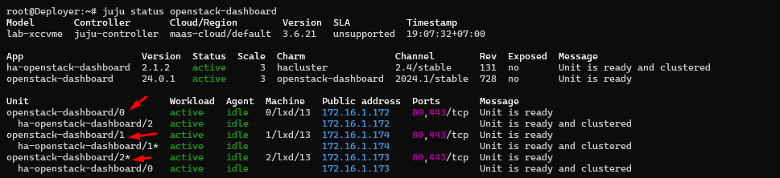

```bash
for i in 0 1 2; do
  echo "=== openstack-dashboard/$i ==="
  juju ssh openstack-dashboard/$i "ls -1 /usr/share/openstack-dashboard/openstack_dashboard/local/enabled/ | grep -i masakari || true"
done
```

### 17\. Vault

Deploy Vault

```bash
juju deploy -n 3 \
  --to lxd:0,lxd:1,lxd:2 \
  --constraints spaces=internal-openstack \
  --channel 1.8/stable \
  --config openstack-caracal.yaml \
  vault
```

```bash
juju deploy --config cluster_count=3 hacluster ha-vault
juju integrate vault:ha ha-vault:ha
```

**initialized**/**Unseal / authorize**

:::warning
Lakukan hanya sekali untuk init di satu unit, lalu unseal semua unit.
:::

Masuk ke unit leader(yang ada tanda \*)

```bash
# misal lxd0
juju ssh vault/0
```

Set `VAULT_ADDR`

```bash
# Gunakan VIP vault
export VAULT_ADDR="http://172.16.2.61:8200"

# Atau ip unit(ip dia sendiri)
export VAULT_ADDR="http://<IP-vault-unit>:8200"
```

**Inisialisasi sekali (Simpan Kode)**

```bash
vault operator init -key-shares=5 -key-threshold=3
```

```bash
root@Deployer:~# juju ssh vault/0

ubuntu@juju-04ba5d-0-lxd-23:~$ export VAULT_ADDR="http://172.16.2.61:8200"
ubuntu@juju-04ba5d-0-lxd-23:~$ vault operator init -key-shares=5 -key-threshold=3
Unseal Key 1: XVnltXBsex7KQBztUxBJiZOlYY3ck7ZH1XkWxBcu5xnR
Unseal Key 2: ZouNtYzgyyOr/PjuB1lnUVe52sYA0bHs3muUa25U6DLO
Unseal Key 3: 8HEQsgrFL/mKsa0aGvBOarJ2mNnoVYwNZaZDlR8GIxV0
Unseal Key 4: afe3k60aam6YmBzmcQFqGcRyMu1ChLigujv87QNPTE3n
Unseal Key 5: fHdg8BOQvYRcOgECAUtbsUxRQ6gsIqk2TDJMqUwEx+6d

Initial Root Token: s.5ptNzKskNLJosqMhwWaIXvKC
```

Unseal semua unit Vault(3)

```bash
# Contoh vault/0
juju ssh vault/0
export VAULT_ADDR="http://127.0.0.1:8200"
vault operator unseal <UNSEAL_KEY_1>
vault operator unseal <UNSEAL_KEY_2>
vault operator unseal <UNSEAL_KEY_3>
vault status
exit
```

Buat token sementara untuk authorize charm(pada leader)

```bash
# Contoh vault/0
juju ssh vault/0
export VAULT_ADDR="http://<VIP-atau-IP-aktif>:8200"
export VAULT_TOKEN="<ROOT_TOKEN>"
vault token create -ttl=10m
exit
```

```bash
ubuntu@juju-04ba5d-0-lxd-23:~$ export VAULT_ADDR="http://172.16.2.61:8200"
ubuntu@juju-04ba5d-0-lxd-23:~$ export VAULT_TOKEN="s.5ptNzKskNLJosqMhwWaIXvKC"
ubuntu@juju-04ba5d-0-lxd-23:~$ vault token create -ttl=10m
Key                  Value
---                  -----
token                s.8EakHbhmAeCcXVmjt3tCat6L
token_accessor       Zxr5NTVuEfqvECM7CAmIwSzw
token_duration       10m
token_renewable      true
token_policies       ["root"]
identity_policies    []
policies             ["root"]
ubuntu@juju-04ba5d-0-lxd-23:~$
```

Authorize charm

```bash
juju run vault/leader authorize-charm token=<TOKEN_SEMENTARA>
```

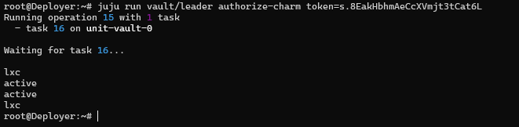

**Integrasi ke service OpenStack**

:::warning
Setelah Vault sudah `active` dan sudah authorized, baru relasikan ke service OpenStack
:::

```bash
watch -c "juju status --color | grep 'vault'"
```

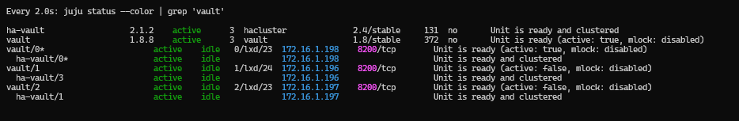

```bash
juju integrate vault keystone
juju integrate vault nova-cloud-controller
juju integrate vault nova-compute
juju integrate vault glance
juju integrate vault neutron-api
juju integrate vault cinder
juju integrate vault placement
juju integrate vault openstack-dashboard
juju integrate vault aodh
juju integrate vault ceilometer
juju integrate vault gnocchi
juju integrate vault masakari
```

Mengambil root CA (Jika diperlukan untuk klien OpenStack)

```bash
juju run vault/leader get-root-ca
```

```bash
root@Deployer:~# juju run vault/leader get-root-ca
Running operation 21 with 1 task
  - task 22 on unit-vault-0

Waiting for task 22...
output: |-
  -----BEGIN CERTIFICATE-----
  MIIDazCCAlOgAwIBAgIULL92jEXKW0xPtJaUzQdqqk2t6AkwDQYJKoZIhvcNAQEL
  BQAwPTE7MDkGA1UEAxMyVmF1bHQgUm9vdCBDZXJ0aWZpY2F0ZSBBdXRob3JpdHkg
  KGNoYXJtLXBraS1sb2NhbCkwHhcNMjYwNDE4MTUyODMzWhcNMzYwNDE1MTQyOTAz
  WjA9MTswOQYDVQQDEzJWYXVsdCBSb290IENlcnRpZmljYXRlIEF1dGhvcml0eSAo
  Y2hhcm0tcGtpLWxvY2FsKTCCASIwDQYJKoZIhvcNAQEBBQADggEPADCCAQoCggEB
  ALqyOseFRaIimy0wFV9CCR/D/v6TyGIjK6SIl1FTvyfYyMdnjzP/XMPy6scK0mBT
  z1OeIcGjcQmALNRvZ28TsQrORlDkENUYkskXraQOg8rTBHpj07tadjbQZbF74LDM
  JL9hblIZqFPBnCfd6cPbUrM2fVaN129YmOJohu8TIzf/btOLXFCbYaj0aRf2jpm0
  LJfehLJ3k1rpKS8nsWY6lfSZ28GEeg+bvvIMcbh7R+yekn0A0hVTnTnKOJBAkCjG
  0wOoULtSXZAX5NsbAoNikFlmy2DAPPkES4bp9gePl2tB0tLBbhfme84jS1frC0d3
  CtPwHiLQWJlF6S1H+0t66o0CAwEAAaNjMGEwDgYDVR0PAQH/BAQDAgEGMA8GA1Ud
  EwEB/wQFMAMBAf8wHQYDVR0OBBYEFClxFXOSKRY2kURejvQui7XMzoMVMB8GA1Ud
  IwQYMBaAFClxFXOSKRY2kURejvQui7XMzoMVMA0GCSqGSIb3DQEBCwUAA4IBAQCj
  c4jmJgX66pwyCE6r+iOZzjdXRlWs57vIibCwVS3mrGxiFYOC9efiNaeJktX5ENJo
  QJtjJdYZ4ls8jnPlkdG6IBktpYow9zQNHtsOU6sq8SMld/616AQIwgPrTwYXA2yk
  kWGkokhy227b+//ynOcaY4oABx2cd7BNOo1/EfIcsFjeyG5COiwaG4wMALeo9Wee
  BrMLsiwucdTaBzXW1hYHkzWOXu99GvPw+d3dzTChDckWYjWdBuLsP8iy7KrBo842
  h+uXggT0PAuWV5e6J2S6ddwJiYKHmIAk6+FM961msFQdQ7Zht/gOZq0tGrcr23YO
  dx4UjPi1nwBdeMEyzOrZ
  -----END CERTIFICATE-----

lxc
active
active
active
lxc
root@Deployer:~#
```

### 19\. Barbican

Deploy Barbican

```bash
juju deploy -n 3 \
  --to lxd:0,lxd:1,lxd:2 \
  --constraints spaces=internal-openstack,external-openstack \
  --channel 2024.1/stable \
  --config openstack-caracal.yaml \
  barbican
```

Deploy HA dan DB router

```bash
juju deploy --config cluster_count=3 hacluster ha-barbican
juju deploy --channel 8.0/stable mysql-router barbican-mysql-router
```

Relasi Barbican utama

```bash
juju integrate barbican:ha ha-barbican:ha
juju integrate barbican-mysql-router:shared-db barbican:shared-db
juju integrate barbican-mysql-router:db-router mysql-innodb-cluster:db-router
juju integrate barbican:amqp rabbitmq-server:amqp
juju integrate barbican:identity-service keystone:identity-service
```

Barbican backend ke Vault

```bash
juju deploy --channel 2024.1/stable barbican-vault
```

Relasi ke Barbican dan Vault

```bash
juju integrate barbican-vault:secrets barbican:secrets
juju integrate barbican-vault:secrets-storage vault:secrets
juju integrate barbican:certificates vault:certificates
juju integrate barbican barbican-vault
juju integrate barbican-vault vault
```

Verifikasi Status Akhir Barbican

```bash
watch -n 2 juju status --color | grep barbican
```

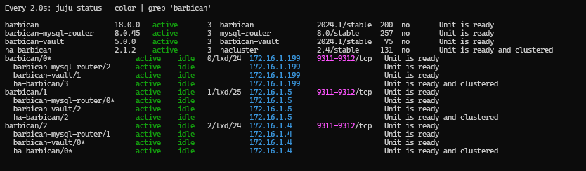

---

### STATUS AKHIR SEMUA APLIKASI/SERVICE ACTIVE

```bash
Every 2.0s: juju status --color                                                                                                                                                                                                                                                                                                                                                                                                                                                                                                                                                                                                                                                                                                                                                                                                                                                                                                                                                                                                                                                                                                                                                                                                                                                                                                                     Deployer: Sun Apr 19 00:00:33 2026

Model       Controller       Cloud/Region        Version  SLA          Timestamp
lab-xccvme  juju-controller  maas-cloud/default  3.6.21   unsupported  00:00:33+07:00

App                       Version  Status  Scale  Charm                  Channel        Rev  Exposed  Message
aodh                      18.0.0   active      3  aodh                   2024.1/stable  138  no       Unit is ready
aodh-mysql-router         8.0.45   active      3  mysql-router           8.0/stable     257  no       Unit is ready
barbican                  18.0.0   active      3  barbican               2024.1/stable  200  no       Unit is ready
barbican-mysql-router     8.0.45   active      3  mysql-router           8.0/stable     257  no       Unit is ready
barbican-vault            5.0.0    active      3  barbican-vault         2024.1/stable   75  no       Unit is ready
ceilometer                22.0.0   active      3  ceilometer             2024.1/stable  582  no       Unit is ready
ceilometer-agent          22.0.0   active      2  ceilometer-agent       2024.1/stable  527  no       Unit is ready
ceph-mon                  19.2.3   active      3  ceph-mon               reef/stable    229  no       Unit is ready and clustered
ceph-osd                  19.2.3   active      2  ceph-osd               reef/stable    616  no       Unit is ready (2 OSD)
cinder                    24.2.0   active      3  cinder                 2024.1/stable  733  no       Unit is ready
cinder-ceph               24.2.0   active      3  cinder-ceph            2024.1/stable  533  no       Unit is ready
cinder-mysql-router       8.0.45   active      3  mysql-router           8.0/stable     257  no       Unit is ready
glance                    28.1.0   active      3  glance                 2024.1/stable  642  no       Unit is ready
glance-mysql-router       8.0.45   active      3  mysql-router           8.0/stable     257  no       Unit is ready
gnocchi                   4.6.0    active      3  gnocchi                2024.1/stable  261  no       Unit is ready
gnocchi-mysql-router      8.0.45   active      3  mysql-router           8.0/stable     257  no       Unit is ready
ha-aodh                   2.1.2    active      3  hacluster              2.4/stable     131  no       Unit is ready and clustered
ha-barbican               2.1.2    active      3  hacluster              2.4/stable     131  no       Unit is ready and clustered
ha-ceilometer             2.1.2    active      3  hacluster              2.4/stable     131  no       Unit is ready and clustered
ha-cinder                 2.1.2    active      3  hacluster              2.4/stable     131  no       Unit is ready and clustered
ha-glance                 2.1.2    active      3  hacluster              2.4/stable     131  no       Unit is ready and clustered
ha-gnocchi                2.1.2    active      3  hacluster              2.4/stable     131  no       Unit is ready and clustered
ha-keystone               2.1.2    active      3  hacluster              2.4/stable     131  no       Unit is ready and clustered
ha-masakari               2.1.2    active      3  hacluster              2.4/stable     131  no       Unit is ready and clustered
ha-neutron-api            2.1.2    active      3  hacluster              2.4/stable     131  no       Unit is ready and clustered
ha-nova-cloud-controller  2.1.2    active      3  hacluster              2.4/stable     131  no       Unit is ready and clustered
ha-openstack-dashboard    2.1.2    active      3  hacluster              2.4/stable     131  no       Unit is ready and clustered
ha-placement              2.1.2    active      3  hacluster              2.4/stable     131  no       Unit is ready and clustered
ha-vault                  2.1.2    active      3  hacluster              2.4/stable     131  no       Unit is ready and clustered
keystone                  25.0.0   active      3  keystone               2024.1/stable  778  no       Application Ready
keystone-mysql-router     8.0.45   active      3  mysql-router           8.0/stable     257  no       Unit is ready
masakari                  17.0.0   active      3  masakari               2024.1/stable   95  no       Unit is ready
masakari-monitors         17.0.1   active      2  masakari-monitors      2024.1/stable  103  no       Unit is ready
masakari-mysql-router     8.0.45   active      3  mysql-router           8.0/stable     257  no       Unit is ready
memcached                          active      3  memcached              latest/stable   39  no       Unit is ready and clustered
mysql-innodb-cluster      8.0.45   active      3  mysql-innodb-cluster   8.0/stable     159  no       Unit is ready: Mode: R/O, Cluster is ONLINE and can tolerate up to ONE failure.
ncc-mysql-router          8.0.45   active      3  mysql-router           8.0/stable     257  no       Unit is ready
neutron-api               24.1.0   active      3  neutron-api            2024.1/stable  650  no       Unit is ready
neutron-api-mysql-router  8.0.45   active      3  mysql-router           8.0/stable     257  no       Unit is ready
neutron-gateway           24.1.0   active      3  neutron-gateway        2024.1/stable  554  no       Unit is ready
neutron-openvswitch       24.1.0   active      2  neutron-openvswitch    2024.1/stable  578  no       Unit is ready
nova-cloud-controller     25.2.1   active      3  nova-cloud-controller  2024.1/stable  795  no       Unit is ready
nova-compute              29.2.0   active      2  nova-compute           2024.1/stable  827  no       Unit is ready
openstack-dashboard       24.0.1   active      3  openstack-dashboard    2024.1/stable  728  no       Unit is ready
pacemaker-remote                   active      2  pacemaker-remote       jammy/stable    23  no       Unit is ready
placement                 11.0.0   active      3  placement              2024.1/stable  125  no       Unit is ready
placement-mysql-router    8.0.45   active      3  mysql-router           8.0/stable     257  no       Unit is ready
rabbitmq-server           3.9.27   active      3  rabbitmq-server        3.9/stable     246  no       Unit is ready and clustered
vault                     1.8.8    active      3  vault                  1.8/stable     372  no       Unit is ready (active: true, mlock: disabled)

Unit                           Workload  Agent      Machine   Public address  Ports           Message
aodh/4                         active    idle       0/lxd/15  172.16.1.178    8042/tcp        Unit is ready
  aodh-mysql-router/3          active    idle                 172.16.1.178                    Unit is ready
  ha-aodh/5                    active    idle                 172.16.1.178                    Unit is ready and clustered
aodh/5*                        active    idle       1/lxd/16  172.16.1.179    8042/tcp        Unit is ready
  aodh-mysql-router/5          active    idle                 172.16.1.179                    Unit is ready
  ha-aodh/6                    active    idle                 172.16.1.179                    Unit is ready and clustered
aodh/6                         active    idle       2/lxd/15  172.16.1.180    8042/tcp        Unit is ready
  aodh-mysql-router/4*         active    idle                 172.16.1.180                    Unit is ready
  ha-aodh/4*                   active    idle                 172.16.1.180                    Unit is ready and clustered
barbican/0*                    active    idle       0/lxd/24  172.16.1.199    9311-9312/tcp   Unit is ready
  barbican-mysql-router/2      active    idle                 172.16.1.199                    Unit is ready
  barbican-vault/1             active    idle                 172.16.1.199                    Unit is ready
  ha-barbican/3                active    idle                 172.16.1.199                    Unit is ready and clustered
barbican/1                     active    idle       1/lxd/25  172.16.1.5      9311-9312/tcp   Unit is ready
  barbican-mysql-router/0*     active    idle                 172.16.1.5                      Unit is ready
  barbican-vault/2             active    idle                 172.16.1.5                      Unit is ready
  ha-barbican/2                active    idle                 172.16.1.5                      Unit is ready and clustered
barbican/2                     active    idle       2/lxd/24  172.16.1.4      9311-9312/tcp   Unit is ready
  barbican-mysql-router/1      active    idle                 172.16.1.4                      Unit is ready
  barbican-vault/0*            active    idle                 172.16.1.4                      Unit is ready
  ha-barbican/0*               active    idle                 172.16.1.4                      Unit is ready and clustered
ceilometer/0*                  active    idle       0/lxd/21  172.16.1.191                    Unit is ready
  ha-ceilometer/0*             active    idle                 172.16.1.191                    Unit is ready and clustered
ceilometer/1                   active    idle       1/lxd/22  172.16.1.192                    Unit is ready
  ha-ceilometer/1              active    idle                 172.16.1.192                    Unit is ready and clustered
ceilometer/2                   active    idle       2/lxd/21  172.16.1.190                    Unit is ready
  ha-ceilometer/2              active    idle                 172.16.1.190                    Unit is ready and clustered
ceph-mon/0                     active    idle       0         172.16.1.134                    Unit is ready and clustered
ceph-mon/1                     active    idle       1         172.16.1.135                    Unit is ready and clustered
ceph-mon/2*                    active    idle       2         172.16.1.137                    Unit is ready and clustered
ceph-osd/0                     active    idle       3         172.16.1.136                    Unit is ready (2 OSD)
ceph-osd/1*                    active    idle       4         172.16.1.138                    Unit is ready (2 OSD)
cinder/0                       active    idle       0/lxd/12  172.16.1.171    8776/tcp        Unit is ready
  cinder-ceph/1                active    idle                 172.16.1.171                    Unit is ready
  cinder-mysql-router/1        active    idle                 172.16.1.171                    Unit is ready
  ha-cinder/2                  active    idle                 172.16.1.171                    Unit is ready and clustered
cinder/1*                      active    idle       1/lxd/12  172.16.1.170    8776/tcp        Unit is ready
  cinder-ceph/0*               active    idle                 172.16.1.170                    Unit is ready
  cinder-mysql-router/0*       active    idle                 172.16.1.170                    Unit is ready
  ha-cinder/0*                 active    idle                 172.16.1.170                    Unit is ready and clustered
cinder/2                       active    idle       2/lxd/12  172.16.1.169    8776/tcp        Unit is ready
  cinder-ceph/2                active    idle                 172.16.1.169                    Unit is ready
  cinder-mysql-router/2        active    idle                 172.16.1.169                    Unit is ready
  ha-cinder/3                  active    idle                 172.16.1.169                    Unit is ready and clustered
glance/0                       active    idle       0/lxd/8   172.16.1.159    9292/tcp        Unit is ready
  glance-mysql-router/1        active    idle                 172.16.1.159                    Unit is ready
  ha-glance/0                  active    idle                 172.16.1.159                    Unit is ready and clustered
glance/1                       active    idle       1/lxd/8   172.16.1.157    9292/tcp        Unit is ready
  glance-mysql-router/0        active    idle                 172.16.1.157                    Unit is ready
  ha-glance/1                  active    idle                 172.16.1.157                    Unit is ready and clustered
glance/2*                      active    idle       2/lxd/8   172.16.1.158    9292/tcp        Unit is ready
  glance-mysql-router/2*       active    idle                 172.16.1.158                    Unit is ready
  ha-glance/2*                 active    idle                 172.16.1.158                    Unit is ready and clustered
gnocchi/12*                    active    idle       0/lxd/20  172.16.1.188    8041/tcp        Unit is ready
  gnocchi-mysql-router/19*     active    idle                 172.16.1.188                    Unit is ready
  ha-gnocchi/15                active    idle                 172.16.1.188                    Unit is ready and clustered
gnocchi/13                     active    idle       1/lxd/21  172.16.1.189    8041/tcp        Unit is ready
  gnocchi-mysql-router/21      active    idle                 172.16.1.189                    Unit is ready
  ha-gnocchi/13*               active    idle                 172.16.1.189                    Unit is ready and clustered
gnocchi/14                     active    idle       2/lxd/20  172.16.1.187    8041/tcp        Unit is ready
  gnocchi-mysql-router/20      active    idle                 172.16.1.187                    Unit is ready
  ha-gnocchi/14                active    idle                 172.16.1.187                    Unit is ready and clustered
keystone/3                     active    idle       0/lxd/6   172.16.1.151    5000/tcp        Unit is ready
  ha-keystone/0                active    idle                 172.16.1.151                    Unit is ready and clustered
  keystone-mysql-router/0      active    idle                 172.16.1.151                    Unit is ready
keystone/4*                    active    executing  1/lxd/6   172.16.1.153    5000/tcp        Unit is ready
  ha-keystone/1*               active    idle                 172.16.1.153                    Unit is ready and clustered
  keystone-mysql-router/1      active    idle                 172.16.1.153                    Unit is ready
keystone/5                     active    idle       2/lxd/6   172.16.1.152    5000/tcp        Unit is ready
  ha-keystone/2                active    idle                 172.16.1.152                    Unit is ready and clustered
  keystone-mysql-router/3*     active    idle                 172.16.1.152                    Unit is ready
masakari/0*                    active    idle       0/lxd/22  172.16.1.194    15868/tcp       Unit is ready
  ha-masakari/2*               active    idle                 172.16.1.194                    Unit is ready and clustered
  masakari-mysql-router/0*     active    idle                 172.16.1.194                    Unit is ready
masakari/1                     active    idle       1/lxd/23  172.16.1.195    15868/tcp       Unit is ready
  ha-masakari/3                active    idle                 172.16.1.195                    Unit is ready and clustered
  masakari-mysql-router/1      active    idle                 172.16.1.195                    Unit is ready
masakari/2                     active    idle       2/lxd/22  172.16.1.193    15868/tcp       Unit is ready
  ha-masakari/0                active    idle                 172.16.1.193                    Unit is ready and clustered
  masakari-mysql-router/2      active    idle                 172.16.1.193                    Unit is ready
memcached/0                    active    idle       0/lxd/11  172.16.1.166    11211/tcp       Unit is ready
memcached/1                    active    idle       1/lxd/11  172.16.1.168    11211/tcp       Unit is ready and clustered
memcached/2*                   active    idle       2/lxd/11  172.16.1.167    11211/tcp       Unit is ready and clustered
mysql-innodb-cluster/9         active    idle       0/lxd/3   172.16.1.142                    Unit is ready: Mode: R/O, Cluster is ONLINE and can tolerate up to ONE failure.
mysql-innodb-cluster/10*       active    idle       1/lxd/3   172.16.1.143                    Unit is ready: Mode: R/W, Cluster is ONLINE and can tolerate up to ONE failure.
mysql-innodb-cluster/11        active    idle       2/lxd/3   172.16.1.144                    Unit is ready: Mode: R/O, Cluster is ONLINE and can tolerate up to ONE failure.
neutron-api/0                  active    idle       0/lxd/7   172.16.1.154    9696/tcp        Unit is ready
  ha-neutron-api/1             active    idle                 172.16.1.154                    Unit is ready and clustered
  neutron-api-mysql-router/0   active    idle                 172.16.1.154                    Unit is ready
neutron-api/1                  active    idle       1/lxd/7   172.16.1.156    9696/tcp        Unit is ready
  ha-neutron-api/2             active    idle                 172.16.1.156                    Unit is ready and clustered
  neutron-api-mysql-router/1   active    idle                 172.16.1.156                    Unit is ready
neutron-api/2*                 active    idle       2/lxd/7   172.16.1.155    9696/tcp        Unit is ready
  ha-neutron-api/0*            active    idle                 172.16.1.155                    Unit is ready and clustered
  neutron-api-mysql-router/2*  active    idle                 172.16.1.155                    Unit is ready
neutron-gateway/0              active    idle       0         172.16.1.134                    Unit is ready
neutron-gateway/1              active    idle       1         172.16.1.135                    Unit is ready
neutron-gateway/2*             active    idle       2         172.16.1.137                    Unit is ready
nova-cloud-controller/0        active    idle       0/lxd/9   172.16.1.162    8774-8775/tcp   Unit is ready
  ha-nova-cloud-controller/2   active    idle                 172.16.1.162                    Unit is ready and clustered
  ncc-mysql-router/2           active    idle                 172.16.1.162                    Unit is ready
nova-cloud-controller/1        active    idle       1/lxd/9   172.16.1.160    8774-8775/tcp   Unit is ready
  ha-nova-cloud-controller/1   active    idle                 172.16.1.160                    Unit is ready and clustered
  ncc-mysql-router/1           active    idle                 172.16.1.160                    Unit is ready
nova-cloud-controller/2*       active    idle       2/lxd/9   172.16.1.161    8774-8775/tcp   Unit is ready
  ha-nova-cloud-controller/0*  active    idle                 172.16.1.161                    Unit is ready and clustered
  ncc-mysql-router/0*          active    idle                 172.16.1.161                    Unit is ready
nova-compute/0                 active    idle       3         172.16.1.136                    Unit is ready
  ceilometer-agent/0           active    idle                 172.16.1.136                    Unit is ready
  masakari-monitors/1          active    idle                 172.16.1.136                    Unit is ready
  neutron-openvswitch/0*       active    idle                 172.16.1.136                    Unit is ready
  pacemaker-remote/0           active    idle                 172.16.1.136                    Unit is ready
nova-compute/1*                active    idle       4         172.16.1.138                    Unit is ready
  ceilometer-agent/1*          active    idle                 172.16.1.138                    Unit is ready
  masakari-monitors/0*         active    idle                 172.16.1.138                    Unit is ready
  neutron-openvswitch/1        active    idle                 172.16.1.138                    Unit is ready
  pacemaker-remote/1*          active    idle                 172.16.1.138                    Unit is ready
openstack-dashboard/0          active    idle       0/lxd/13  172.16.1.172    80,443/tcp      Unit is ready
  ha-openstack-dashboard/2     active    idle                 172.16.1.172                    Unit is ready and clustered
openstack-dashboard/1          active    idle       1/lxd/13  172.16.1.174    80,443/tcp      Unit is ready
  ha-openstack-dashboard/1*    active    idle                 172.16.1.174                    Unit is ready and clustered
openstack-dashboard/2*         active    idle       2/lxd/13  172.16.1.173    80,443/tcp      Unit is ready
  ha-openstack-dashboard/0     active    idle                 172.16.1.173                    Unit is ready and clustered
placement/0                    active    idle       0/lxd/10  172.16.1.164    8778/tcp        Unit is ready
  ha-placement/0               active    idle                 172.16.1.164                    Unit is ready and clustered
  placement-mysql-router/0     active    idle                 172.16.1.164                    Unit is ready
placement/1*                   active    idle       1/lxd/10  172.16.1.165    8778/tcp        Unit is ready
  ha-placement/1*              active    idle                 172.16.1.165                    Unit is ready and clustered
  placement-mysql-router/2*    active    idle                 172.16.1.165                    Unit is ready
placement/2                    active    idle       2/lxd/10  172.16.1.163    8778/tcp        Unit is ready
  ha-placement/3               active    idle                 172.16.1.163                    Unit is ready and clustered
  placement-mysql-router/1     active    idle                 172.16.1.163                    Unit is ready
rabbitmq-server/0              active    idle       0/lxd/4   172.16.1.146    5672,15672/tcp  Unit is ready and clustered
rabbitmq-server/1              active    idle       1/lxd/4   172.16.1.145    5672,15672/tcp  Unit is ready and clustered
rabbitmq-server/2*             active    idle       2/lxd/4   172.16.1.147    5672,15672/tcp  Unit is ready and clustered
vault/0*                       active    idle       0/lxd/23  172.16.1.198    8200/tcp        Unit is ready (active: true, mlock: disabled)
  ha-vault/0*                  active    idle                 172.16.1.198                    Unit is ready and clustered
vault/1                        active    idle       1/lxd/24  172.16.1.196    8200/tcp        Unit is ready (active: false, mlock: disabled)
  ha-vault/3                   active    idle                 172.16.1.196                    Unit is ready and clustered
vault/2                        active    idle       2/lxd/23  172.16.1.197    8200/tcp        Unit is ready (active: false, mlock: disabled)
  ha-vault/1                   active    idle                 172.16.1.197                    Unit is ready and clustered

Machine   State    Address       Inst id               Base          AZ       Message
0         started  172.16.1.134  ctrl-01               ubuntu@22.04  default  Deployed
0/lxd/3   started  172.16.1.142  juju-04ba5d-0-lxd-3   ubuntu@22.04  default  Container started
0/lxd/4   started  172.16.1.146  juju-04ba5d-0-lxd-4   ubuntu@22.04  default  Container started
0/lxd/6   started  172.16.1.151  juju-04ba5d-0-lxd-6   ubuntu@22.04  default  Container started
0/lxd/7   started  172.16.1.154  juju-04ba5d-0-lxd-7   ubuntu@22.04  default  Container started
0/lxd/8   started  172.16.1.159  juju-04ba5d-0-lxd-8   ubuntu@22.04  default  Container started
0/lxd/9   started  172.16.1.162  juju-04ba5d-0-lxd-9   ubuntu@22.04  default  Container started
0/lxd/10  started  172.16.1.164  juju-04ba5d-0-lxd-10  ubuntu@22.04  default  Container started
0/lxd/11  started  172.16.1.166  juju-04ba5d-0-lxd-11  ubuntu@22.04  default  Container started
0/lxd/12  started  172.16.1.171  juju-04ba5d-0-lxd-12  ubuntu@22.04  default  Container started
0/lxd/13  started  172.16.1.172  juju-04ba5d-0-lxd-13  ubuntu@22.04  default  Container started
0/lxd/15  started  172.16.1.178  juju-04ba5d-0-lxd-15  ubuntu@22.04  default  Container started
0/lxd/20  started  172.16.1.188  juju-04ba5d-0-lxd-20  ubuntu@22.04  default  Container started
0/lxd/21  started  172.16.1.191  juju-04ba5d-0-lxd-21  ubuntu@22.04  default  Container started
0/lxd/22  started  172.16.1.194  juju-04ba5d-0-lxd-22  ubuntu@22.04  default  Container started
0/lxd/23  started  172.16.1.198  juju-04ba5d-0-lxd-23  ubuntu@22.04  default  Container started
0/lxd/24  started  172.16.1.199  juju-04ba5d-0-lxd-24  ubuntu@22.04  default  Container started
1         started  172.16.1.135  ctrl-03               ubuntu@22.04  default  Deployed
1/lxd/3   started  172.16.1.143  juju-04ba5d-1-lxd-3   ubuntu@22.04  default  Container started
1/lxd/4   started  172.16.1.145  juju-04ba5d-1-lxd-4   ubuntu@22.04  default  Container started
1/lxd/6   started  172.16.1.153  juju-04ba5d-1-lxd-6   ubuntu@22.04  default  Container started
1/lxd/7   started  172.16.1.156  juju-04ba5d-1-lxd-7   ubuntu@22.04  default  Container started
1/lxd/8   started  172.16.1.157  juju-04ba5d-1-lxd-8   ubuntu@22.04  default  Container started
1/lxd/9   started  172.16.1.160  juju-04ba5d-1-lxd-9   ubuntu@22.04  default  Container started
1/lxd/10  started  172.16.1.165  juju-04ba5d-1-lxd-10  ubuntu@22.04  default  Container started
1/lxd/11  started  172.16.1.168  juju-04ba5d-1-lxd-11  ubuntu@22.04  default  Container started
1/lxd/12  started  172.16.1.170  juju-04ba5d-1-lxd-12  ubuntu@22.04  default  Container started
1/lxd/13  started  172.16.1.174  juju-04ba5d-1-lxd-13  ubuntu@22.04  default  Container started
1/lxd/16  started  172.16.1.179  juju-04ba5d-1-lxd-16  ubuntu@22.04  default  Container started
1/lxd/21  started  172.16.1.189  juju-04ba5d-1-lxd-21  ubuntu@22.04  default  Container started
1/lxd/22  started  172.16.1.192  juju-04ba5d-1-lxd-22  ubuntu@22.04  default  Container started
1/lxd/23  started  172.16.1.195  juju-04ba5d-1-lxd-23  ubuntu@22.04  default  Container started
1/lxd/24  started  172.16.1.196  juju-04ba5d-1-lxd-24  ubuntu@22.04  default  Container started
1/lxd/25  started  172.16.1.5    juju-04ba5d-1-lxd-25  ubuntu@22.04  default  Container started
2         started  172.16.1.137  ctrl-02               ubuntu@22.04  default  Deployed
2/lxd/3   started  172.16.1.144  juju-04ba5d-2-lxd-3   ubuntu@22.04  default  Container started
2/lxd/4   started  172.16.1.147  juju-04ba5d-2-lxd-4   ubuntu@22.04  default  Container started
2/lxd/6   started  172.16.1.152  juju-04ba5d-2-lxd-6   ubuntu@22.04  default  Container started
2/lxd/7   started  172.16.1.155  juju-04ba5d-2-lxd-7   ubuntu@22.04  default  Container started
2/lxd/8   started  172.16.1.158  juju-04ba5d-2-lxd-8   ubuntu@22.04  default  Container started
2/lxd/9   started  172.16.1.161  juju-04ba5d-2-lxd-9   ubuntu@22.04  default  Container started
2/lxd/10  started  172.16.1.163  juju-04ba5d-2-lxd-10  ubuntu@22.04  default  Container started
2/lxd/11  started  172.16.1.167  juju-04ba5d-2-lxd-11  ubuntu@22.04  default  Container started
2/lxd/12  started  172.16.1.169  juju-04ba5d-2-lxd-12  ubuntu@22.04  default  Container started
2/lxd/13  started  172.16.1.173  juju-04ba5d-2-lxd-13  ubuntu@22.04  default  Container started
2/lxd/15  started  172.16.1.180  juju-04ba5d-2-lxd-15  ubuntu@22.04  default  Container started
2/lxd/20  started  172.16.1.187  juju-04ba5d-2-lxd-20  ubuntu@22.04  default  Container started
2/lxd/21  started  172.16.1.190  juju-04ba5d-2-lxd-21  ubuntu@22.04  default  Container started
2/lxd/22  started  172.16.1.193  juju-04ba5d-2-lxd-22  ubuntu@22.04  default  Container started
2/lxd/23  started  172.16.1.197  juju-04ba5d-2-lxd-23  ubuntu@22.04  default  Container started
2/lxd/24  started  172.16.1.4    juju-04ba5d-2-lxd-24  ubuntu@22.04  default  Container started
3         started  172.16.1.136  comp-02               ubuntu@22.04  default  Deployed
4         started  172.16.1.138  comp-01               ubuntu@22.04  default  Deployed
```

---

### FINISH | INSTALASI OPENSTACK CHARM 2024.1/stable

**Next →**