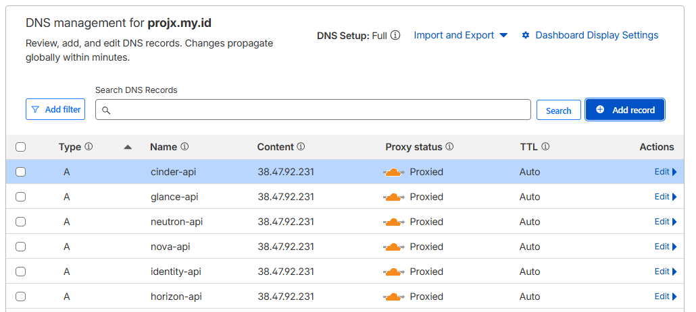
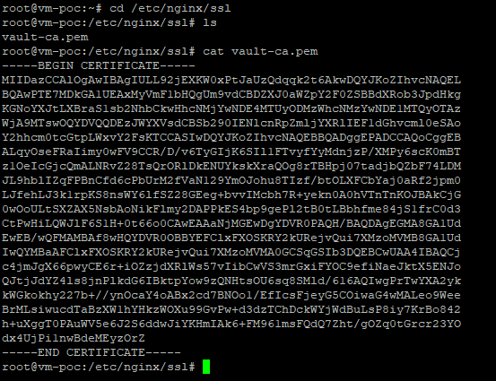
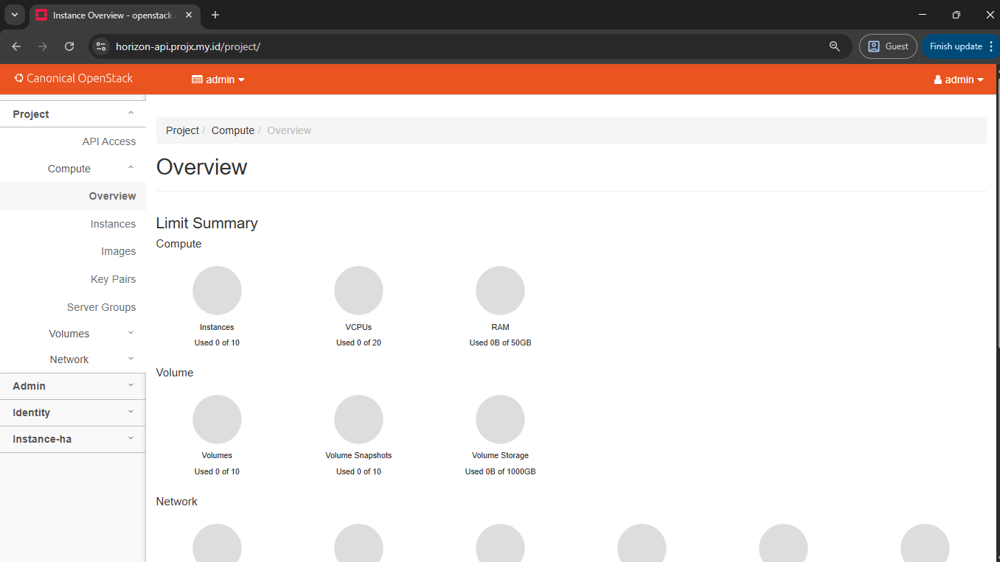
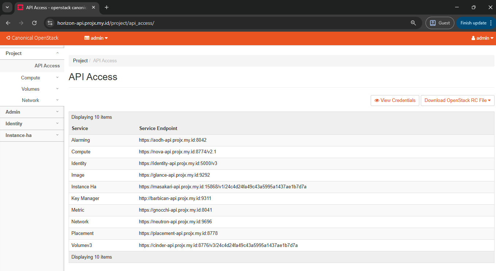

# Expose Domain (Proxy)

:::info
Menggunakan 1 VM reverse proxy di luar cluster
:::

### Pre-Requirement

- NIC public → Internet
- NIC private → bisa reach VIP OpenStack
- DNS public arahkan ke IP VM reverse proxy
- Koneksi https CA dari Vault
- Cloudflare

---

Tujuan:

:::info
Agar bisa untuk operasi publik dasar seperti akses CLI dari luar dan melakukan operasi dasar tenant serta agar bisa semua operasi GUI Horizon normal.
:::

Komponen yang di Expose

- Horizon → [horizon-api.projx.my.id](http://horizon-api.projx.my.id)
- Keystone → [identity-api.projx.my.id](http://identity-api.projx.my.id)
- Nova → [nova-api.projx.my.id](http://nova-api.projx.my.id)
- Neutron → [neutron-api.projx.my.id](http://neutron-api.projx.my.id)
- Glance → [glance-api.projx.my.id](http://glance-api.projx.my.id)
- Cinder → [cinder-api.projx.my.id](http://cinder-api.projx.my.id)

---

**Cloudflare:**



### nginx:

Menggunakan Sertifikat vault untuk konek ke VIP External dengan HTTPS

```bash
sudo mkdir -p /etc/nginx/ssl

sudo chmod 644 /etc/nginx/ssl/vault-ca.pem
```



Buat snippet common untuk semua proxy OpenStack

```bash
sudo mkdir -p /etc/nginx/snippets
sudo nano /etc/nginx/snippets/openstack-proxy-common.conf
```

```bash
proxy_http_version 1.1;

proxy_set_header X-Real-IP $remote_addr;
proxy_set_header X-Forwarded-For $proxy_add_x_forwarded_for;
proxy_set_header X-Forwarded-Proto https;
proxy_set_header X-Forwarded-Host $host;
proxy_set_header Connection "";

proxy_request_buffering off;
proxy_buffering off;
proxy_redirect off;

proxy_read_timeout 3600s;
proxy_send_timeout 3600s;
send_timeout 3600s;

proxy_ssl_trusted_certificate /etc/nginx/ssl/vault-ca.pem;
proxy_ssl_verify on;
proxy_ssl_server_name on;
```

Generate Sertifikat cerbot

```bash
sudo systemctl stop nginx

sudo certbot certonly --standalone --cert-name openstack \
  -d horizon-api.projx.my.id \
  -d identity-api.projx.my.id \
  -d nova-api.projx.my.id \
  -d neutron-api.projx.my.id \
  -d glance-api.projx.my.id \
  -d cinder-api.projx.my.id
```

Buat File Konfigurasi di `sites-available`

```bash
cd /etc/nginx/sites-available/
```

nano [horizon-api.projx.my.id](http://horizon-api.projx.my.id)

```bash
server {
    listen 80;
    server_name horizon-api.projx.my.id;
    return 301 https://$host$request_uri;
}

server {
    listen 443 ssl http2;
    server_name horizon-api.projx.my.id;

    ssl_certificate     /etc/letsencrypt/live/openstack/fullchain.pem;
    ssl_certificate_key /etc/letsencrypt/live/openstack/privkey.pem;

    client_max_body_size 10G;

    location / {
        proxy_pass https://172.16.4.50:443;

        proxy_set_header Host horizon-api.projx.my.id;
        proxy_ssl_name horizon-api.projx.my.id;

        include /etc/nginx/snippets/openstack-proxy-common.conf;
    }
}
```

nano [identity-api.projx.my.id](http://identity-api.projx.my.id)

```bash
server {
    listen 80;
    server_name identity-api.projx.my.id;
    return 301 https://$host$request_uri;
}

server {
    listen 443 ssl http2;
    server_name identity-api.projx.my.id;

    ssl_certificate     /etc/letsencrypt/live/openstack/fullchain.pem;
    ssl_certificate_key /etc/letsencrypt/live/openstack/privkey.pem;

    client_max_body_size 10G;

    location / {
        proxy_pass https://172.16.4.52:5000;

        proxy_set_header Host identity-api.projx.my.id;
        proxy_ssl_name identity-api.projx.my.id;

        include /etc/nginx/snippets/openstack-proxy-common.conf;
    }
}
```

nano [nova-api.projx.my.id](http://nova-api.projx.my.id)

```bash
server {
    listen 80;
    server_name nova-api.projx.my.id;
    return 301 https://$host$request_uri;
}

server {
    listen 443 ssl http2;
    server_name nova-api.projx.my.id;

    ssl_certificate     /etc/letsencrypt/live/openstack/fullchain.pem;
    ssl_certificate_key /etc/letsencrypt/live/openstack/privkey.pem;

    client_max_body_size 10G;

    location / {
        proxy_pass https://172.16.4.59:8774;

        proxy_set_header Host nova-api.projx.my.id;
        proxy_ssl_name nova-api.projx.my.id;

        include /etc/nginx/snippets/openstack-proxy-common.conf;
    }
}
```

nano [neutron-api.projx.my.id](http://neutron-api.projx.my.id)

```bash
server {
    listen 80;
    server_name neutron-api.projx.my.id;
    return 301 https://$host$request_uri;
}

server {
    listen 443 ssl http2;
    server_name neutron-api.projx.my.id;

    ssl_certificate     /etc/letsencrypt/live/openstack/fullchain.pem;
    ssl_certificate_key /etc/letsencrypt/live/openstack/privkey.pem;

    client_max_body_size 10G;

    location / {
        proxy_pass https://172.16.4.51:9696;

        proxy_set_header Host neutron-api.projx.my.id;
        proxy_ssl_name neutron-api.projx.my.id;

        include /etc/nginx/snippets/openstack-proxy-common.conf;
    }
}
```

nano [glance-api.projx.my.id](http://glance-api.projx.my.id)

```bash
server {
    listen 80;
    server_name glance-api.projx.my.id;
    return 301 https://$host$request_uri;
}

server {
    listen 443 ssl http2;
    server_name glance-api.projx.my.id;

    ssl_certificate     /etc/letsencrypt/live/openstack/fullchain.pem;
    ssl_certificate_key /etc/letsencrypt/live/openstack/privkey.pem;

    client_max_body_size 10G;

    location / {
        proxy_pass https://172.16.4.58:9292;

        proxy_set_header Host glance-api.projx.my.id;
        proxy_ssl_name glance-api.projx.my.id;

        include /etc/nginx/snippets/openstack-proxy-common.conf;
    }
}
```

nano [cinder-api.projx.my.id](http://cinder-api.projx.my.id)

```bash
server {
    listen 80;
    server_name cinder-api.projx.my.id;
    return 301 https://$host$request_uri;
}

server {
    listen 443 ssl http2;
    server_name cinder-api.projx.my.id;

    ssl_certificate     /etc/letsencrypt/live/openstack/fullchain.pem;
    ssl_certificate_key /etc/letsencrypt/live/openstack/privkey.pem;

    client_max_body_size 10G;

    location / {
        proxy_pass https://172.16.4.56:8776;

        proxy_set_header Host cinder-api.projx.my.id;
        proxy_ssl_name cinder-api.projx.my.id;

        include /etc/nginx/snippets/openstack-proxy-common.conf;
    }
}
```

Aktifkan Site

```bash
sudo ln -s /etc/nginx/sites-available/horizon-api.projx.my.id  /etc/nginx/sites-enabled/horizon-api.projx.my.id
sudo ln -s /etc/nginx/sites-available/identity-api.projx.my.id /etc/nginx/sites-enabled/identity-api.projx.my.id
sudo ln -s /etc/nginx/sites-available/glance-api.projx.my.id   /etc/nginx/sites-enabled/glance-api.projx.my.id
sudo ln -s /etc/nginx/sites-available/nova-api.projx.my.id     /etc/nginx/sites-enabled/nova-api.projx.my.id
sudo ln -s /etc/nginx/sites-available/neutron-api.projx.my.id  /etc/nginx/sites-enabled/neutron-api.projx.my.id
sudo ln -s /etc/nginx/sites-available/cinder-api.projx.my.id   /etc/nginx/sites-enabled/cinder-api.projx.my.id
```

```bash
sudo nginx -t
```

```bash
sudo systemctl restart nginx
```

---

Akses Dashboard public

```bash
https://horizon-api.projx.my.id
```



**Next →**