# MAAS Configure

API Proxmox Info for MAAS

```bash
TOKEN_SECRET:
Token_id: yezato@pve!yudi-maas
API token secret: f51c6129-6a93-4b9f-a316-ec04ff2a5718
```

### NETWORK INTERFACE

| No  | NIC fisik | Alokasi | Alamat subnet |
| --- | --- | --- | --- |
| 1   | NIC-1 | Management khusus | `172.16.1.0/24` |
| 2   | NIC-2 | External OpenStack khusus | `172.16.4.0/24` |
| 3   | NIC-3 | Internal OpenStack khusus | `172.16.2.0/24` |
| 4   | NIC-4 | Storage khusus | `172.16.5.0/24` |
| 5   | NIC-5 | Provider / physnet khusus | `172.16.3.0/24` |

## Persiapan Infrastruktur MAAS (Metal As A Service)

Target → Vm MAAS

### Instalasi MAAS & Database Lokal

```bash
# 1. Update sistem dasar
sudo apt update && sudo apt upgrade -y

# 2. Instal MAAS dan database testing/lokal
sudo snap install maas
sudo snap install maas-test-db

# 3. Inisialisasi MAAS (sebagai Region & Rack controller)
sudo maas init region+rack --database-uri maas-test-db:///

# 4. Buat akun administrator untuk login ke Web UI
sudo maas createadmin
```

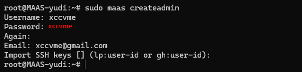

### Konfigurasi MAAS via Web Dashboard

```bash
http://172.16.1.2:5240/MAAS
```

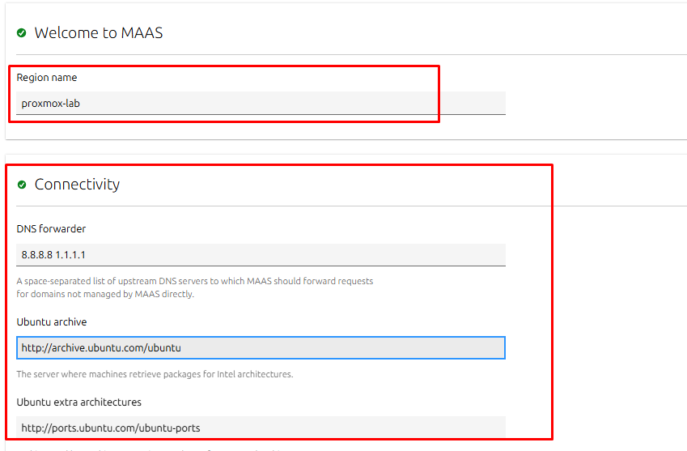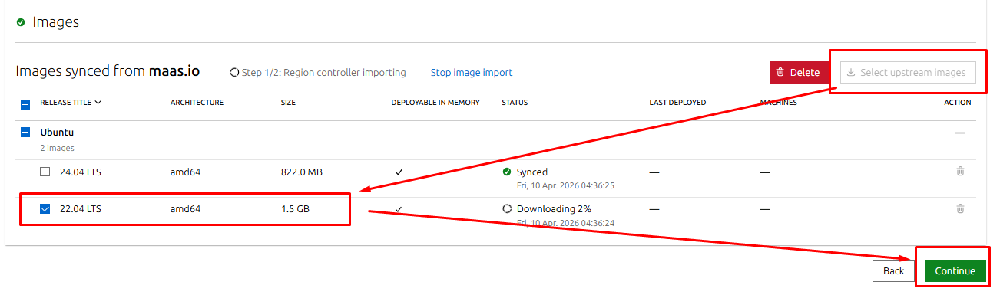

### Mengaktifkan DHCP & Konfigurasi Network

:::info
MAAS harus menjadi prioritas di jaringan `net0` agar bisa melakukan _PXE Boot_ ke VM lain.
:::

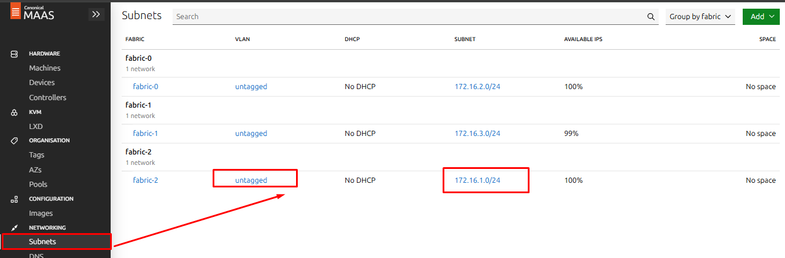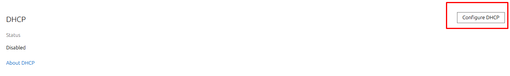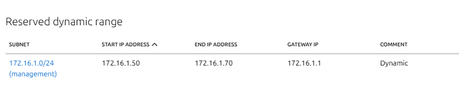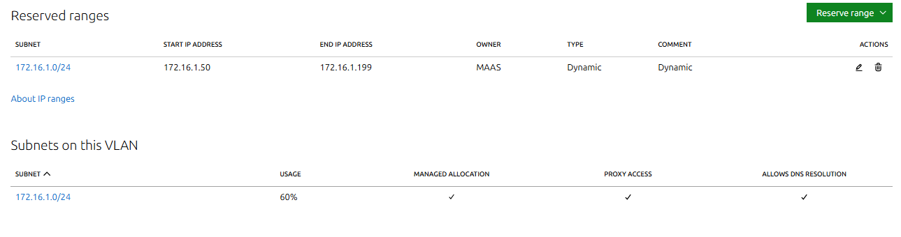

### SPACE (ALL SUBNET)

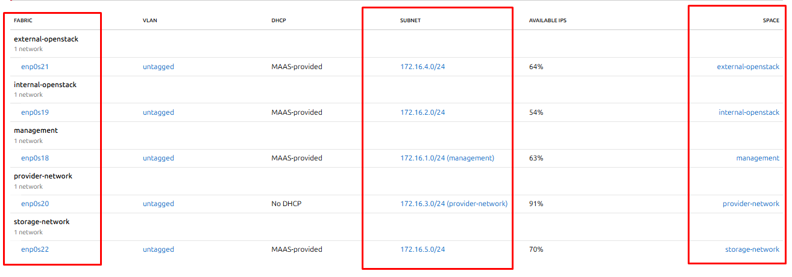

### MAAS Enlisting Node

:::info
- `http://172.16.1.2:5240/MAAS`
:::

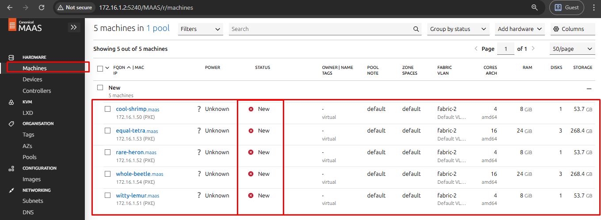

:::success
kelima mesin tersebut akan muncul secara otomatis di daftar dengan status `New`
:::

### Ganti Nama & Pemberian Tag (untuk Juju)

:::warning
Example ⬇️
:::

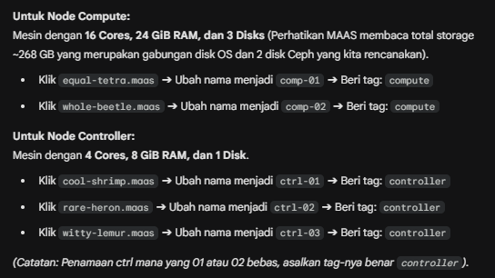

### Power configuration(Proxmox)

:::info
Power type: Proxmox

Proxmox host name or IP: 172.16.1.1

Proxmox username: yezato@pve

Proxmox password: \*\*\*\*\*

Proxmox API token name: yudi-maas

Proxmox API token secret: f51c6129-6a93-4b9f-a316-ec04ff2a5718

Node ID: (sesuaikan)

Verify SSL: no
:::

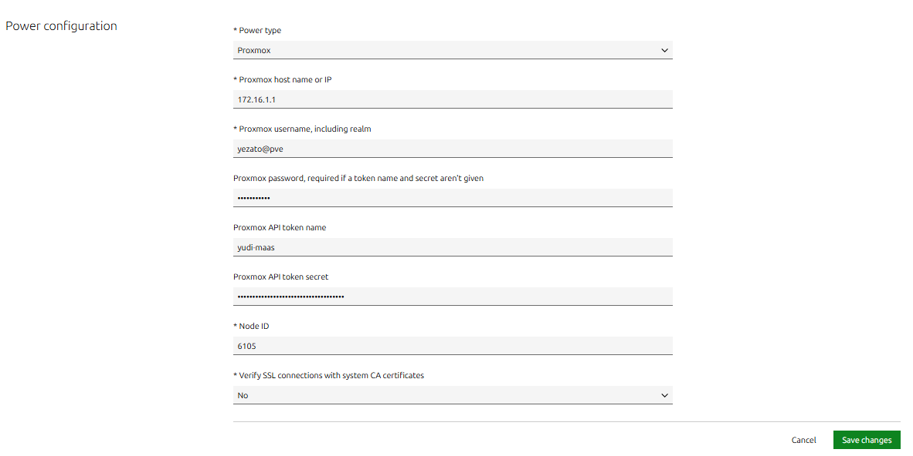

### Proxy MAAS

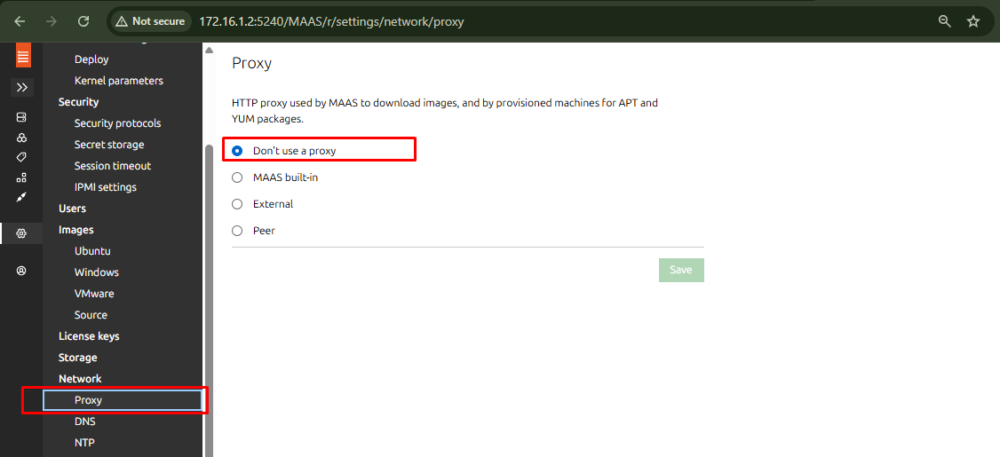

### Repo MAAS

```bash
http://mirrors.ubuntu.com/ID.txt
```

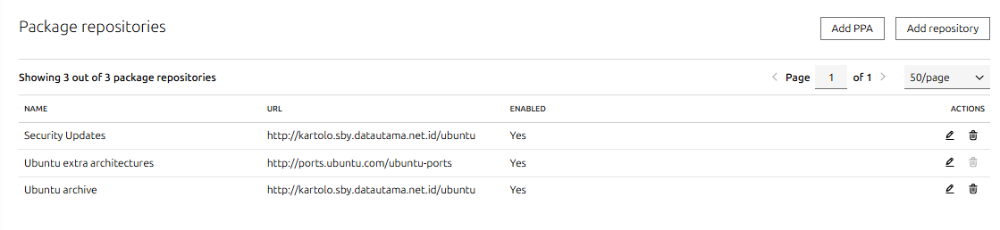

```bash
sudo snap restart maas
```

### Proses _Commissioning_ (Pengujian _Hardware_)

:::info
Menguji _hardware_, memetakan _disk_, dan menyiapkan _node_ agar berstatus `Ready` (siap diinstal OS oleh Juju).
:::

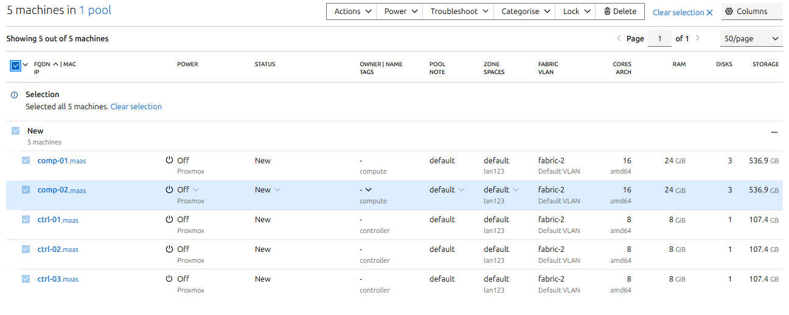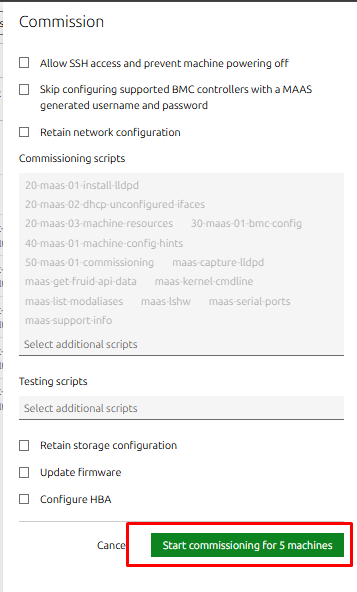

:::warning
VM akan melakukan _PXE Boot_, menjalankan _script_ pengujian MAAS, dan otomatis mati sendiri jika sudah selesai.
:::

:::success
Jika sudah mati, Status kuning `Commissioning` seharusnya akan berubah menjadi hijau `Ready`.
:::

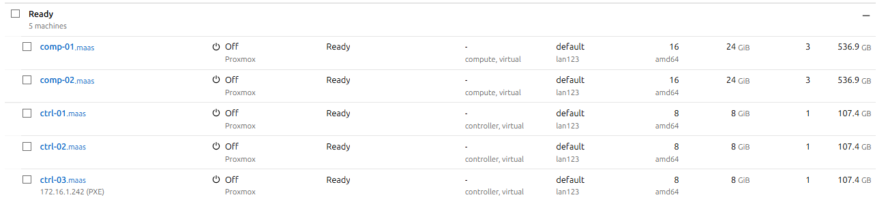

### Verifikasi Storage untuk Ceph

:::warning
Karena menggunakan skema _Hyperconverged_ Ceph, wajib memastikan MAAS mendeteksi _disk_ kosong dengan benar tanpa memformatnya.
:::

:::info
jika mengklik nama `comp-01 dan comp-02` dan masuk ke tab Storage, pastikan dua _disk_ tambahan (yang 100GB) berstatus Unused.
:::

:::success
Available disks and partitions disk tersebut Unused dan tidak memiliki partisi (_raw_).
:::

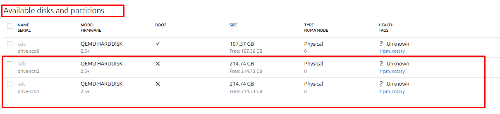

### Verifikasi Interface Network semua NOde

Misal Node comp-01 (5 interface)

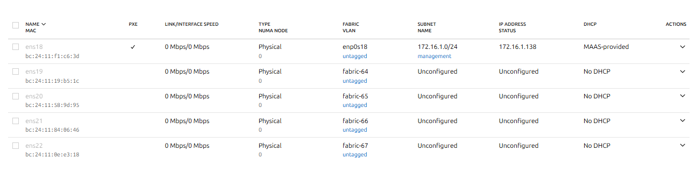

**Next →**