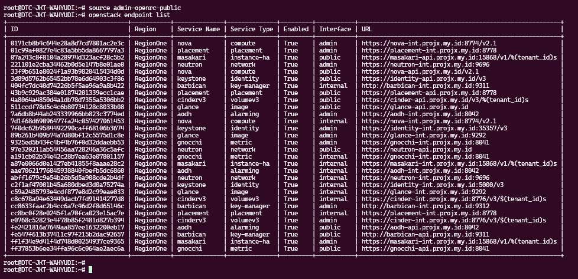
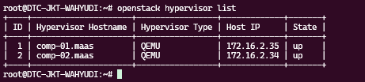
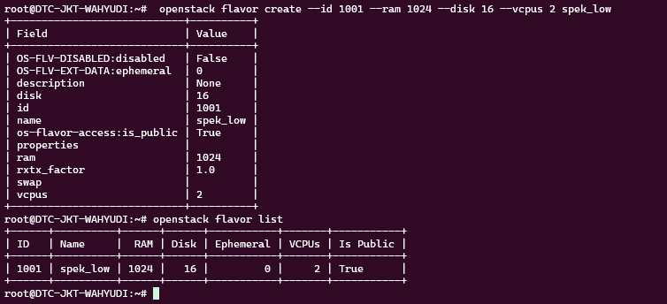
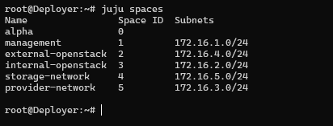
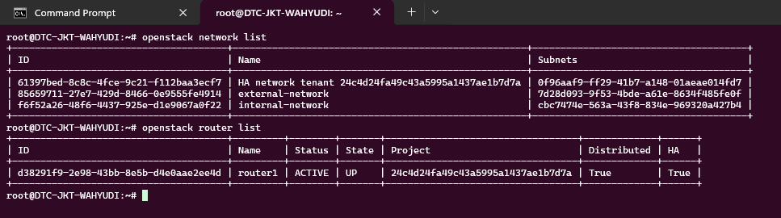
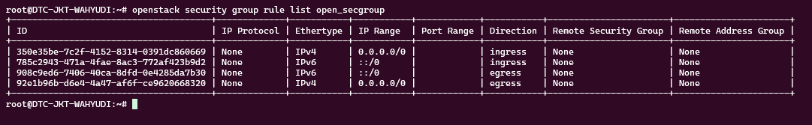
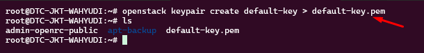
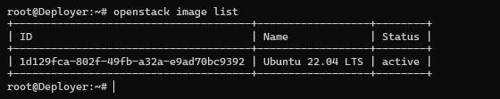
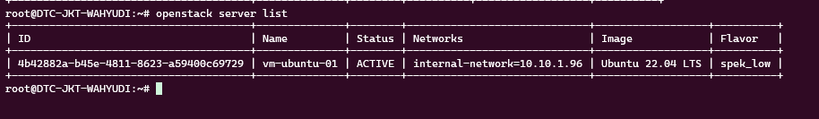
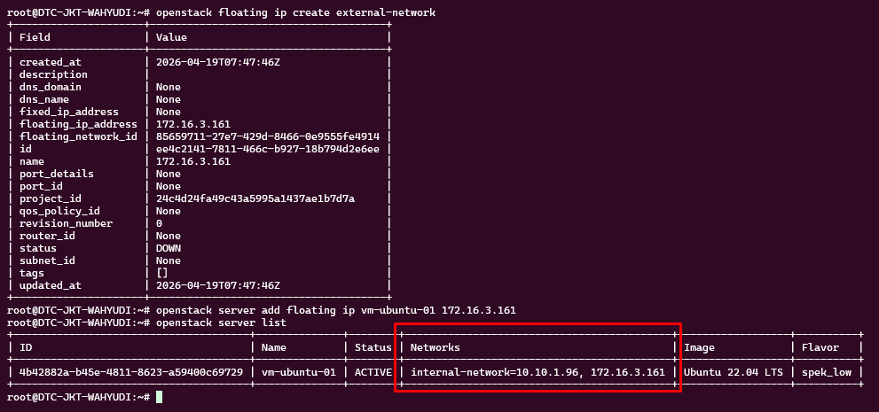

# Operasional CLI

### Admin Credensial

:::info
Akses endpoint public/external
:::

```bash
cat > ~/admin-openrc-public <<'EOF'
export OS_AUTH_URL=https://identity-api.projx.my.id/v3
export OS_USERNAME=admin
export OS_PASSWORD='Kstn-Adm!n-2026-Projx'
export OS_PROJECT_NAME=admin
export OS_USER_DOMAIN_NAME=admin_domain
export OS_PROJECT_DOMAIN_NAME=admin_domain
export OS_IDENTITY_API_VERSION=3
export OS_AUTH_TYPE=password
export OS_REGION_NAME=RegionOne
export OS_INTERFACE=public
EOF
```

```bash
source ~/admin-openrc-public
```

```bash
apt  install python3-openstackclient -y
```

```bash
openstack endpoint list
openstack service list
openstack catalog list
```



## Create Flavor

Admin -> Compute -> Flavors -> Create Flavor.

```bash
 openstack flavor create --id 1001 --ram 1024 --disk 16 --vcpus 2 spek_low
```



## External + Internal Network + Router



### Membuat External/Provider Network

```bash
# Membuat external network yang dipetakan ke physnet1
openstack network create --share --external \
  --provider-physical-network physnet1 \
  --provider-network-type flat external-network

# Membuat subnet untuk external network (sesuaikan allocation-pool agar tidak bentrok dengan IP statis lain)
openstack subnet create --network external-network \
  --allocation-pool start=172.16.3.100,end=172.16.3.200 \
  --dns-nameserver 8.8.8.8 \
  --gateway 172.16.3.1 \
  --subnet-range 172.16.3.0/24 external-subnet
```

### Membuat Internal/Tenant Network

```bash
# Membuat internal network
openstack network create internal-network

# Membuat subnet untuk internal network
openstack subnet create --network internal-network \
  --dns-nameserver 8.8.8.8 \
  --dns-nameserver 1.1.1.1 \
  --subnet-range 10.10.1.0/24 internal-subnet
```

### Membuat Virtual Router dan Menghubungkan Jaringan

```bash
# Membuat router
openstack router create router1

# Mengatur gateway eksternal untuk router
openstack router set router1 --external-gateway external-network

# Menambahkan jaringan internal ke router
openstack router add subnet router1 internal-subnet
```



---

## Port Security

:::warning
Allow all inbound port
:::

```bash
# Membuat Security Group
openstack security group create --description "Allow all inbound and outbound traffic" open_secgroup

# Buka Semua Port & Protocol Masuk (Ingress)
openstack security group rule create --proto any --ethertype IPv4 --ingress --remote-ip 0.0.0.0/0 open_secgroup

openstack security group rule create --proto any --ethertype IPv6 --ingress --remote-ip ::/0 open_secgroup

# Buka Semua Port & Protocol Keluar (Egress)
openstack security group rule create --proto any --ethertype IPv4 --egress --remote-ip 0.0.0.0/0 open_secgroup

openstack security group rule create --proto any --ethertype IPv6 --egress --remote-ip ::/0 open_secgroup
```

verifikasi

```bash
openstack security group rule list open_secgroup
```



---

## Membuat Key Pairs (Kunci SSH)

```bash
openstack keypair create default-key > default-key.pem 
hmod 600 default-key.pem
```



---

## Cloud Init (User-data)

```bash
nano user-data.yaml
```

```bash
#cloud-config
users:
  - default
  - name: xccvme
    groups: [sudo]
    shell: /bin/bash
    sudo: ALL=(ALL) NOPASSWD:ALL
    lock_passwd: false

ssh_pwauth: true
disable_root: false

chpasswd:
  expire: false
  users:
    - name: xccvme
      password: xccvme
      type: text
    - name: root
      password: xccvme
      type: text

write_files:
  - path: /etc/ssh/sshd_config.d/99-custom-password-auth.conf
    permissions: '0644'
    content: |
      PasswordAuthentication yes
      PermitRootLogin yes

runcmd:
  - systemctl restart ssh || systemctl restart sshd
```

---

## Create Image (Ubuntu 22.04 LTS)

:::warning
Pakai Endpoint (Admin credensial internal)
:::

```bash
# Download image
wget --show-progress https://cloud-images.ubuntu.com/jammy/20260320/jammy-server-cloudimg-amd64.img

# Create image
openstack image create "Ubuntu 22.04 LTS" \
  --file jammy-server-cloudimg-amd64.img \
  --disk-format qcow2 \
  --container-format bare \
  --public \
  --property description="jammy-server-cloudimg-amd64.img"
```



---

## Create VM

```bash
openstack server create --image "Ubuntu 22.04 LTS" \
  --flavor Spek_mini \
  --network external-network \
  --security-group open_secgroup \
  --key-name default-key \
  --user-data user-data.yaml \
  vm-test-1
```

<details>
<summary>Create V2</summary>

:::warning
Gunakan jikak metadata (Cloud ini t by network tidak jalan)
:::

```bash
openstack server create --image "Ubuntu 22.04 LTS" \
  --flavor spek_low \
  --network internal-network \
  --security-group open_secgroup \
  --key-name default-key \
  --user-data user-data.yaml \
  --config-drive true \
  vm-ubuntu-01
```

</details>

```bash
openstack server list
```



### Alokasikan Floating IP Baru

```bash
openstack floating ip create external-network
```

Pasang Floating IP ke VM

```bash
openstack server add floating ip vm-ubuntu-01 <FLOATING_IP>
```

Verifikasi

```bash
openstack server list
```



---

### Remote SSH

```bash
ssh root@172.16.3.161

root:xccvme
```

---

**Back ←**