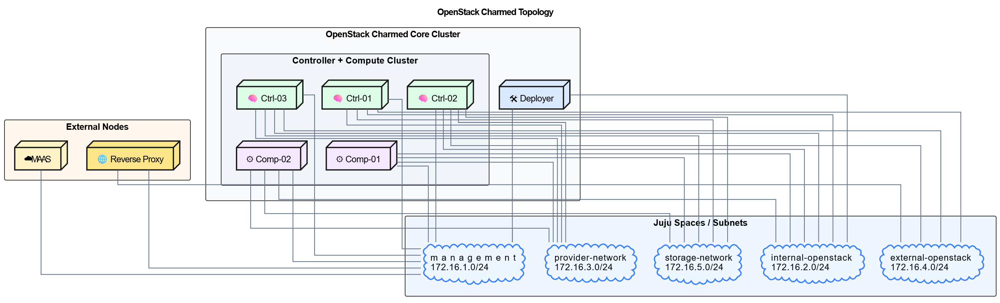
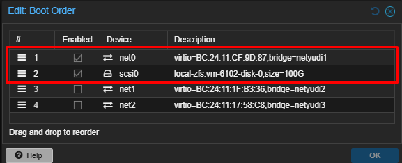

# Topologi

---

Topologi

---



| No  | NIC fisik | Alokasi | Alamat subnet |
| --- | --- | --- | --- |
| 1   | NIC-1 | Management khusus | `172.16.1.0/24` |
| 2   | NIC-2 | External OpenStack khusus | `172.16.4.0/24` |
| 3   | NIC-3 | Internal OpenStack khusus | `172.16.2.0/24` |
| 4   | NIC-4 | Storage khusus | `172.16.5.0/24` |
| 5   | NIC-5 | Provider / physnet khusus | `172.16.3.0/24` |

---

Spesifikasi VM & Disk

---

|     |     |     |     |     |     |
| --- | --- | --- | --- | --- | --- |
| Nama Node | vCPU | RAM | Disk OS | Disk Ceph | Peran Utama |
| MAAS | 4   | 12 GB | 100 GB | \-  | PXE Boot, DHCP, DNS, OS Provisioning |
| Deployer | 8   | 16 GB | 100 GB | \-  | Juju Controller & CLI Command Center |
| Ctrl-01 | 8   | 16 GB | 100 GB | \-  | API OpenStack, MySQL/Galera, Vault |
| Ctrl-02 | 8   | 16 GB | 100 GB | \-  | High Availability (HA) Quorum |
| Ctrl-03 | 8   | 16 GB | 100 GB | \-  | High Availability (HA) Quorum |
| Comp-01 | 16  | 24 GB | 100 GB | 2× 200 GB | Hyperconverged Compute & Ceph OSD |
| Comp-02 | 16  | 24 GB | 100 GB | 2× 200 GB | Hyperconverged Compute & Ceph OSD |

### Persyaratan KVM-OK di Semua Node Compute

```bash
root@compute:~# kvm-ok
INFO: /dev/kvm exists
KVM acceleration can be used
```



:::warning
Boot Order semua Controller dan Compute di ganti dengan PXE net0
:::

---

IP Mapping

---

### External API — `172.16.4.0/24`

| No  | IP VIP | Hostname |
| --- | --- | --- |
| 1   | `172.16.4.50` | `horizon-api.projx.my.id` |
| 2   | `172.16.4.51` | `neutron-api.projx.my.id` |
| 3   | `172.16.4.52` | `identity-api.projx.my.id` |
| 4   | `172.16.4.53` | `gnocchi-api.projx.my.id` |
| 5   | `172.16.4.54` | `aodh-api.projx.my.id` |
| 6   | `172.16.4.55` | `ceilometer-api.projx.my.id` |
| 7   | `172.16.4.56` | `cinder-api.projx.my.id` |
| 8   | `172.16.4.57` | `placement-api.projx.my.id` |
| 9   | `172.16.4.58` | `glance-api.projx.my.id` |
| 10  | `172.16.4.59` | `nova-api.projx.my.id` |
| 11  | `172.16.4.60` | `masakari-api.projx.my.id` |
| 12  | `172.16.4.61` | `barbican-api.projx.my.id` |

### Internal / service API — `172.16.2.0/24`

| No  | IP VIP | Hostname |
| --- | --- | --- |
| 1   | `172.16.2.50` | `neutron-int.projx.my.id` |
| 2   | `172.16.2.51` | `identity-int.projx.my.id` |
| 3   | `172.16.2.52` | `gnocchi-int.projx.my.id` |
| 4   | `172.16.2.53` | `aodh-int.projx.my.id` |
| 5   | `172.16.2.54` | `ceilometer-int.projx.my.id` |
| 6   | `172.16.2.55` | `cinder-int.projx.my.id` |
| 7   | `172.16.2.56` | `placement-int.projx.my.id` |
| 8   | `172.16.2.57` | `glance-int.projx.my.id` |
| 9   | `172.16.2.58` | `nova-int.projx.my.id` |
| 10  | `172.16.2.59` | `masakari-int.projx.my.id` |
| 11  | `172.16.2.60` | `barbican-int.projx.my.id` |
| 12  | `172.16.2.61` | `vault-int.projx.my.id` |

### Storage / Ceph — `172.16.5.0/24`

| No  | IP  | Hostname | Keterangan |
| --- | --- | --- | --- |
| 1   | `172.16.5.50` | `ceph-mon-01.storage.projx.my.id` | MON 1 |
| 2   | `172.16.5.51` | `ceph-mon-02.storage.projx.my.id` | MON 2 |
| 3   | `172.16.5.52` | `ceph-mon-03.storage.projx.my.id` | MON 3 |

```bash
sudo nano /etc/netplan/70-extra.yaml
```

```bash
network:
  version: 2
  ethernets:
    ens19:
      dhcp4: false
      addresses:
        - 172.16.2.x/24
    ens20:
      dhcp4: false
      addresses:
        - 172.16.3.x/24
    ens21:
      dhcp4: false
      addresses:
        - 172.16.4.x/24
    ens22:
      dhcp4: false
      addresses:
        - 172.16.5.x/24
```

```bash
sudo netplan generate
sudo netplan try
sudo netplan apply
```

**Next →**