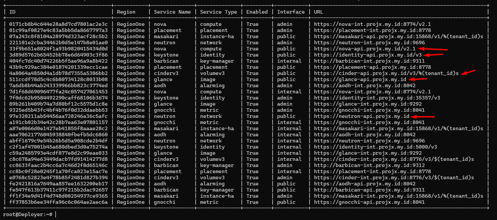

# Ubah Endpoint public jadi murni HTTPS

### Kondisi awal

:::info
Login dengan credensial internal
:::

```bash
root@Deployer:~# source admin-openrc
root@Deployer:~# openstack catalog list
+-----------+-------------+----------------------------------------------------------------------------------------+
| Name      | Type        | Endpoints                                                                              |
+-----------+-------------+----------------------------------------------------------------------------------------+
| nova      | compute     | RegionOne                                                                              |
|           |             |   admin: https://nova-int.projx.my.id:8774/v2.1                                        |
|           |             | RegionOne                                                                              |
|           |             |   public: https://nova-api.projx.my.id:8774/v2.1                                       |
|           |             | RegionOne                                                                              |
|           |             |   internal: https://nova-int.projx.my.id:8774/v2.1                                     |
|           |             |                                                                                        |
| masakari  | instance-ha | RegionOne                                                                              |
|           |             |   public: https://masakari-api.projx.my.id:15868/v1/24c4d24fa49c43a5995a1437ae1b7d7a   |
|           |             | RegionOne                                                                              |
|           |             |   internal: https://masakari-int.projx.my.id:15868/v1/24c4d24fa49c43a5995a1437ae1b7d7a |
|           |             | RegionOne                                                                              |
|           |             |   admin: https://masakari-int.projx.my.id:15868/v1/24c4d24fa49c43a5995a1437ae1b7d7a    |
|           |             |                                                                                        |
| cinderv3  | volumev3    | RegionOne                                                                              |
|           |             |   public: https://cinder-api.projx.my.id:8776/v3/24c4d24fa49c43a5995a1437ae1b7d7a      |
|           |             | RegionOne                                                                              |
|           |             |   internal: https://cinder-int.projx.my.id:8776/v3/24c4d24fa49c43a5995a1437ae1b7d7a    |
|           |             | RegionOne                                                                              |
|           |             |   admin: https://cinder-int.projx.my.id:8776/v3/24c4d24fa49c43a5995a1437ae1b7d7a       |
|           |             |                                                                                        |
| keystone  | identity    | RegionOne                                                                              |
|           |             |   public: https://identity-api.projx.my.id:5000/v3                                     |
|           |             | RegionOne                                                                              |
|           |             |   admin: https://identity-int.projx.my.id:35357/v3                                     |
|           |             | RegionOne                                                                              |
|           |             |   internal: https://identity-int.projx.my.id:5000/v3                                   |
|           |             |                                                                                        |
| neutron   | network     | RegionOne                                                                              |
|           |             |   admin: https://neutron-int.projx.my.id:9696                                          |
|           |             | RegionOne                                                                              |
|           |             |   public: https://neutron-api.projx.my.id:9696                                         |
|           |             | RegionOne                                                                              |
|           |             |   internal: https://neutron-int.projx.my.id:9696                                       |
|           |             |                                                                                        |
| aodh      | alarming    | RegionOne                                                                              |
|           |             |   admin: https://aodh-int.projx.my.id:8042                                             |
|           |             | RegionOne                                                                              |
|           |             |   internal: https://aodh-int.projx.my.id:8042                                          |
|           |             | RegionOne                                                                              |
|           |             |   public: https://aodh-api.projx.my.id:8042                                            |
|           |             |                                                                                        |
| placement | placement   | RegionOne                                                                              |
|           |             |   admin: https://placement-int.projx.my.id:8778                                        |
|           |             | RegionOne                                                                              |
|           |             |   public: https://placement-api.projx.my.id:8778                                       |
|           |             | RegionOne                                                                              |
|           |             |   internal: https://placement-int.projx.my.id:8778                                     |
|           |             |                                                                                        |
| barbican  | key-manager | RegionOne                                                                              |
|           |             |   internal: http://barbican-int.projx.my.id:9311                                       |
|           |             | RegionOne                                                                              |
|           |             |   admin: http://barbican-int.projx.my.id:9312                                          |
|           |             | RegionOne                                                                              |
|           |             |   public: http://barbican-api.projx.my.id:9311                                         |
|           |             |                                                                                        |
| glance    | image       | RegionOne                                                                              |
|           |             |   public: https://glance-api.projx.my.id:9292                                          |
|           |             | RegionOne                                                                              |
|           |             |   admin: https://glance-int.projx.my.id:9292                                           |
|           |             | RegionOne                                                                              |
|           |             |   internal: https://glance-int.projx.my.id:9292                                        |
|           |             |                                                                                        |
| gnocchi   | metric      | RegionOne                                                                              |
|           |             |   admin: https://gnocchi-int.projx.my.id:8041                                          |
|           |             | RegionOne                                                                              |
|           |             |   internal: https://gnocchi-int.projx.my.id:8041                                       |
|           |             | RegionOne                                                                              |
|           |             |   public: https://gnocchi-api.projx.my.id:8041                                         |
|           |             |                                                                                        |
+-----------+-------------+----------------------------------------------------------------------------------------+
root@Deployer:~#
```

### Ubah Endpoint Public murni https yang sudah di Expos(nginx)

:::info
Kecuali Horizon (Bukan endpoint Catalog)
:::

```bash
openstack endpoint set --url https://identity-api.projx.my.id/v3 3d89d5762b65452bb78e6d64903c3f86
openstack endpoint set --url https://glance-api.projx.my.id 511ccdf78d5c4c6b80734128c8033b08
openstack endpoint set --url https://nova-api.projx.my.id/v2.1 33f9b651e8024f1a93b9820415434d0d
openstack endpoint set --url https://neutron-api.projx.my.id 97e320211ab54456aa728246a36c5afc
openstack endpoint set --url 'https://cinder-api.projx.my.id/v3/%(tenant_id)s' 4a8064a4850d4a1db78d7355a5306bb2
```

```bash
openstack catalog list
openstack endpoint list
```

:::warning
Yang harus berubah adalah endpoint `public` menjadi:

- `keystone public: https://identity-api.projx.my.id/v3`
- `glance public: https://glance-api.projx.my.id`
- `nova public: https://nova-api.projx.my.id/v2.1`
- `neutron public: https://neutron-api.projx.my.id`
- `cinderv3 public: https://cinder-api.projx.my.id/v3/...`
:::



**Next →**