# Vault CA ➡️ Let's Encrypt

==Kendala:==

:::warning
==Vault's== `<`upload-signed-csr`>`==mengharapkan sertifikat Intermediate CA — bukan domain certificate biasa. Let's Encrypt tidak bisa menandatangani Intermediate CA CSR, mereka hanya menerbitkan end-entity domain certificates.==
:::

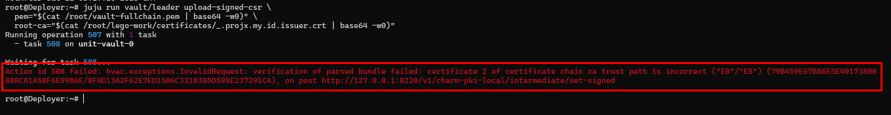

---

### **CA by Manual Inject**

:::note
Dengan cara Assign LE Cert Langsung ke Setiap Service (Tanpa Vault PKI)  
Menggunakan sertifikat LE wildcard yang sudah ada untuk setiap charm
:::

by Cloudflared:

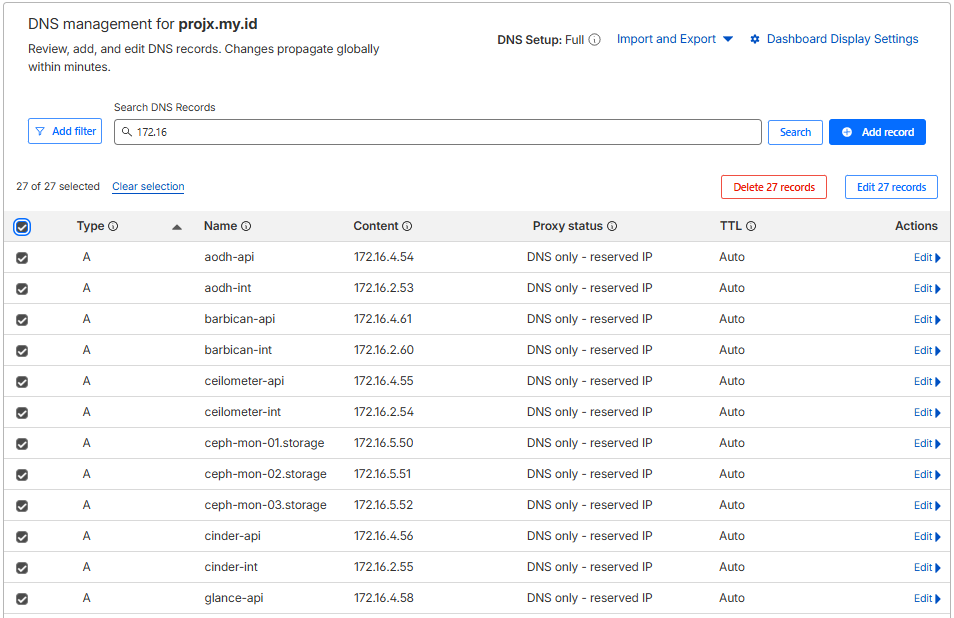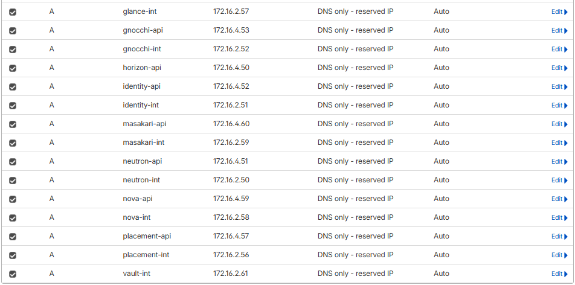

---

:::warning
Jika sempat di ubah ke endpoint public (Proxy nginx), Kembalikan ke URL Asli service:port
:::

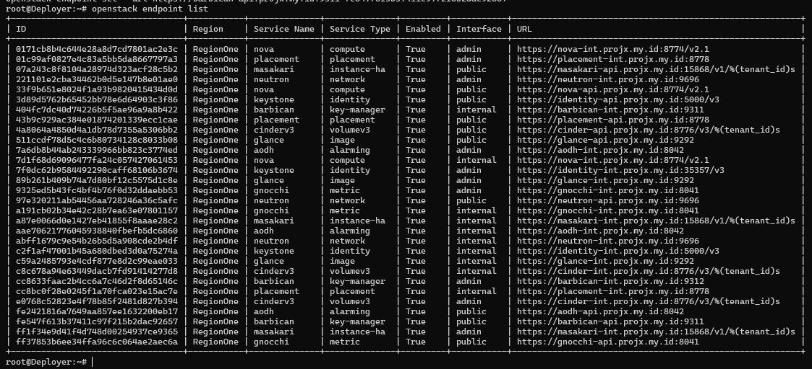

:::danger
👍
:::

---

### Tools

```bash
sudo apt install certbot -y
```

Install `lego` di Deployer (Release versi terbaru)

:::info
Sesuai Arsitektu

https://github.com/go-acme/lego/releases

(example: [**linux_amd64.tar.gz**](https://github.com/go-acme/lego/releases/download/v4.35.1/lego_v4.35.1_linux_amd64.tar.gz))
:::

```bash
# Cek arsitektur
uname -m
(x86_64)

# Download lego versi terbaru
cd /tmp
wget https://github.com/go-acme/lego/releases/download/v4.35.1/lego_v4.35.1_linux_amd64.tar.gz

# Extract dan install
tar -xzf lego_v4.35.1_linux_amd64.tar.gz
sudo mv lego /usr/local/bin/
sudo chmod +x /usr/local/bin/lego

# Verifikasi
lego --version
```

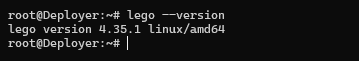

Generate CSR dari Vault

```bash
juju run vault/leader get-csr 2>&1
```

```bash
root@Deployer:~# juju run vault/leader get-csr 2>&1
Running operation 505 with 1 task
  - task 506 on unit-vault-0

Waiting for task 506...
output: |-
  -----BEGIN CERTIFICATE REQUEST-----
  MIICijCCAXICAQAwRTFDMEEGA1UEAxM6VmF1bHQgSW50ZXJtZWRpYXRlIENlcnRp
  ZmljYXRlIEF1dGhvcml0eSAoY2hhcm0tcGtpLWxvY2FsKTCCASIwDQYJKoZIhvcN
  AQEBBQADggEPADCCAQoCggEBAMYhDsB3UXdSot7sIoMmC6o7MVajIx/NT4kPfEBd
  FvhdC68lGh95B7azYusQXbS4b13bcAzUbJoMukGKMHIbJOPxQzjPcU5iG1/zGlCz
  KSduhKDfJF+TA1sJBoCBHJXLiKqK5r1gMXdc+Ocfjbm5pQMzbZBO4ahwern7IlIT
  ZvVgOifoglBtTPu3S2kB5tio6EB3MaW8HTCZthEHk9CKkDIghxcAuKHXzNF/dN8T
  KZCQFnDLpBQDMnTZzkVGNOH+M73Spu07UBSPhldg1XVpHg1SyZrL6GpRbtw+2GkF
  cZkrWP/W8zJJxpO6mG5hfgkouAhUYQBIvr2XmPuTKO4IU8UCAwEAAaAAMA0GCSqG
  SIb3DQEBCwUAA4IBAQAkTyK1ekrwReJU3KYzcn9u1fszNrQDnhBIKCA3kI1t8umh
  BAQe3FLDP4FEViPuCuDAeJV+QWbX0bATi5EjWGv7yUpvD22BrozrpTL5gfTcgjvM
  LEkf0AICNT+peU3rmdjL8lOnT/SHQK8M5r0T2myqtYp7nx4XQu9DHli/95+6212o
  w52eW7WE49A3LzbjcBCBcuw4kiHRqG+Xr/cW/8tX+DzdxVkVXZD7tYJZm0i1b87Q
  Jc49od5MQHoAeUt0BVUQQuSC4WeY48+vneSXO0p2v9WeHepWnhfUnyDqqTV7+agZ
  AUNHUG+0FHcG+6/99W7J0UtqENZxQbw8/DBN+E/g
  -----END CERTIFICATE REQUEST-----

lxc
active
root@Deployer:~#
```

Simpan CSR ke file

```bash
cat > /root/vault-charm.csr << 'EOF'
-----BEGIN CERTIFICATE REQUEST-----
MIICijCCAXICAQAwRTFDMEEGA1UEAxM6VmF1bHQgSW50ZXJtZWRpYXRlIENlcnRp
ZmljYXRlIEF1dGhvcml0eSAoY2hhcm0tcGtpLWxvY2FsKTCCASIwDQYJKoZIhvcN
AQEBBQADggEPADCCAQoCggEBAMYhDsB3UXdSot7sIoMmC6o7MVajIx/NT4kPfEBd
FvhdC68lGh95B7azYusQXbS4b13bcAzUbJoMukGKMHIbJOPxQzjPcU5iG1/zGlCz
KSduhKDfJF+TA1sJBoCBHJXLiKqK5r1gMXdc+Ocfjbm5pQMzbZBO4ahwern7IlIT
ZvVgOifoglBtTPu3S2kB5tio6EB3MaW8HTCZthEHk9CKkDIghxcAuKHXzNF/dN8T
KZCQFnDLpBQDMnTZzkVGNOH+M73Spu07UBSPhldg1XVpHg1SyZrL6GpRbtw+2GkF
cZkrWP/W8zJJxpO6mG5hfgkouAhUYQBIvr2XmPuTKO4IU8UCAwEAAaAAMA0GCSqG
SIb3DQEBCwUAA4IBAQAkTyK1ekrwReJU3KYzcn9u1fszNrQDnhBIKCA3kI1t8umh
BAQe3FLDP4FEViPuCuDAeJV+QWbX0bATi5EjWGv7yUpvD22BrozrpTL5gfTcgjvM
LEkf0AICNT+peU3rmdjL8lOnT/SHQK8M5r0T2myqtYp7nx4XQu9DHli/95+6212o
w52eW7WE49A3LzbjcBCBcuw4kiHRqG+Xr/cW/8tX+DzdxVkVXZD7tYJZm0i1b87Q
Jc49od5MQHoAeUt0BVUQQuSC4WeY48+vneSXO0p2v9WeHepWnhfUnyDqqTV7+agZ
AUNHUG+0FHcG+6/99W7J0UtqENZxQbw8/DBN+E/g
-----END CERTIFICATE REQUEST-----
EOF
```

Verifikasi CSR Valid

```bash
openssl req -in /root/vault-charm.csr -noout -text | head -20
```

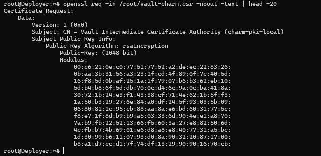

Sign dengan Let's Encrypt

```bash
mkdir -p /root/lego-work
```

```bash
# Set token dulu
export CLOUDFLARE_DNS_API_TOKEN=<API-TOKEN-CLOUDFLARE>

lego \
  --email unpwahyu@gmail.com \
  --dns cloudflare \
  --domains "*.projx.my.id" \
  --domains "projx.my.id" \
  --path /root/lego-work \
  --server https://acme-v02.api.letsencrypt.org/directory \
  run
```

<details>
<summary>Output</summary>

```bash
root@Deployer:~# export CLOUDFLARE_DNS_API_TOKEN=cfut_73B8jEucsHZ0YRyKdqFpvw8XXCCUAlWWf3ZOmF3v361075f9

lego \
  --email unpwahyu@gmail.com \
  --dns cloudflare \
  --domains "*.projx.my.id" \
  --domains "projx.my.id" \
  --path /root/lego-work \
  --server https://acme-v02.api.letsencrypt.org/directory \
  run
2026/04/22 11:25:28 No key found for account unpwahyu@gmail.com. Generating a P256 key.
2026/04/22 11:25:28 Saved key to /root/lego-work/accounts/acme-v02.api.letsencrypt.org/unpwahyu@gmail.com/keys/unpwahyu@gmail.com.key
2026/04/22 11:25:29 Please review the TOS at https://letsencrypt.org/documents/LE-SA-v1.6-August-18-2025.pdf
Do you accept the TOS? Y/n
y
2026/04/22 11:25:32 [INFO] acme: Registering account for unpwahyu@gmail.com
!!!! HEADS UP !!!!

Your account credentials have been saved in your
configuration directory at "/root/lego-work/accounts".

You should make a secure backup of this folder now. This
configuration directory will also contain private keys
generated by lego and certificates obtained from the ACME
server. Making regular backups of this folder is ideal.
2026/04/22 11:25:32 [INFO] [*.projx.my.id, projx.my.id] acme: Obtaining bundled SAN certificate
2026/04/22 11:25:33 [INFO] [*.projx.my.id] AuthURL: https://acme-v02.api.letsencrypt.org/acme/authz/3263368661/691937701001
2026/04/22 11:25:33 [INFO] [projx.my.id] AuthURL: https://acme-v02.api.letsencrypt.org/acme/authz/3263368661/691937701091
2026/04/22 11:25:33 [INFO] [*.projx.my.id] acme: use dns-01 solver
2026/04/22 11:25:33 [INFO] [projx.my.id] acme: Could not find solver for: tls-alpn-01
2026/04/22 11:25:33 [INFO] [projx.my.id] acme: Could not find solver for: http-01
2026/04/22 11:25:33 [INFO] [projx.my.id] acme: use dns-01 solver
2026/04/22 11:25:33 [INFO] [*.projx.my.id] acme: Preparing to solve DNS-01
2026/04/22 11:25:34 [INFO] cloudflare: new record for projx.my.id, ID a421603ae3695c22b8810ec92c1ce42b
2026/04/22 11:25:34 [INFO] [projx.my.id] acme: Preparing to solve DNS-01
2026/04/22 11:25:35 [INFO] cloudflare: new record for projx.my.id, ID c7a899b92e77f5e2e4bcbf80722b7beb
2026/04/22 11:25:35 [INFO] [*.projx.my.id] acme: Trying to solve DNS-01
2026/04/22 11:25:35 [INFO] [*.projx.my.id] acme: Checking DNS record propagation. [nameservers=8.8.8.8:53,1.1.1.1:53]
2026/04/22 11:25:37 [INFO] Wait for propagation [timeout: 2m0s, interval: 2s]
2026/04/22 11:25:38 [INFO] [*.projx.my.id] acme: Waiting for DNS record propagation.
2026/04/22 11:25:44 [INFO] [*.projx.my.id] The server validated our request
2026/04/22 11:25:44 [INFO] [projx.my.id] acme: Trying to solve DNS-01
2026/04/22 11:25:44 [INFO] [projx.my.id] acme: Checking DNS record propagation. [nameservers=8.8.8.8:53,1.1.1.1:53]
2026/04/22 11:25:46 [INFO] Wait for propagation [timeout: 2m0s, interval: 2s]
2026/04/22 11:25:50 [INFO] [projx.my.id] The server validated our request
2026/04/22 11:25:50 [INFO] [*.projx.my.id] acme: Cleaning DNS-01 challenge
2026/04/22 11:25:51 [INFO] [projx.my.id] acme: Cleaning DNS-01 challenge
2026/04/22 11:25:51 [INFO] [*.projx.my.id, projx.my.id] acme: Validations succeeded; requesting certificates
2026/04/22 11:25:53 [INFO] [*.projx.my.id] Server responded with a certificate.
root@Deployer:~#
```

</details>

Verifikasi File Sertifikat

```bash
ls -la /root/lego-work/certificates/
```

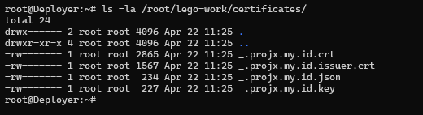

Siapkan & Upload ke Vault

```bash
# Gabungkan fullchain
cat /root/lego-work/certificates/_.projx.my.id.crt \
    /root/lego-work/certificates/_.projx.my.id.issuer.crt \
    > /root/vault-fullchain.pem

# Verifikasi chain
openssl x509 -in /root/lego-work/certificates/_.projx.my.id.crt \
  -noout -subject -issuer -dates

# Upload ke Vault
juju run vault/leader upload-signed-csr \
  pem="$(cat /root/vault-fullchain.pem | base64 -w0)" \
  root-ca="$(cat /root/lego-work/certificates/_.projx.my.id.issuer.crt | base64 -w0)"
```


---

### ==Assign LE Cert ke Semua OpenStack Services==

Siapkan Variabel CA

```bash
export SSL_CERT="$(cat /root/lego-work/certificates/_.projx.my.id.crt)"
export SSL_KEY="$(cat /root/lego-work/certificates/_.projx.my.id.key)"
export SSL_CA="$(cat /root/lego-work/certificates/_.projx.my.id.issuer.crt)"

# Verifikasi tidak kosong
echo "CERT: ${#SSL_CERT} chars"
echo "KEY:  ${#SSL_KEY} chars"
echo "CA:   ${#SSL_CA} chars"

# Encode ke base64 dulu
export SSL_CERT_B64="$(cat /root/lego-work/certificates/_.projx.my.id.crt | base64 -w0)"
export SSL_KEY_B64="$(cat /root/lego-work/certificates/_.projx.my.id.key | base64 -w0)"
export SSL_CA_B64="$(cat /root/lego-work/certificates/_.projx.my.id.issuer.crt | base64 -w0)"

# Verifikasi
echo "CERT_B64: ${#SSL_CERT_B64} chars"
echo "KEY_B64:  ${#SSL_KEY_B64} chars"
echo "CA_B64:   ${#SSL_CA_B64} chars"
```

Assign ke Semua Services Sekaligus

```
for app in \
  keystone \
  nova-cloud-controller \
  cinder \
  neutron-api \
  glance \
  placement \
  aodh \
  barbican \
  gnocchi \
  masakari \
  openstack-dashboard; do

  echo "=== Reconfiguring: $app ==="
  juju config $app \
    ssl_cert="${SSL_CERT_B64}" \
    ssl_key="${SSL_KEY_B64}" \
    ssl_ca="${SSL_CA_B64}" && echo "✅ $app SUCCESS" || echo "❌ $app FAILED"
done
```

Hapus Relasi vault ke service agar tidak override CA

```bash
for app in \
  keystone \
  nova-cloud-controller \
  cinder \
  neutron-api \
  glance \
  placement \
  aodh \
  barbican \
  gnocchi \
  masakari \
  openstack-dashboard; do

  echo "=== Removing vault relation: $app ==="
  juju remove-relation vault:certificates ${app}:certificates \
    && echo "✅ $app done" \
    || echo "⚠️  $app skipped"
done
```

Monitor Status (Tunggu Semua Active)

```bash
watch -n5 'juju status | grep -E "blocked|error|waiting|maintenance"'
```

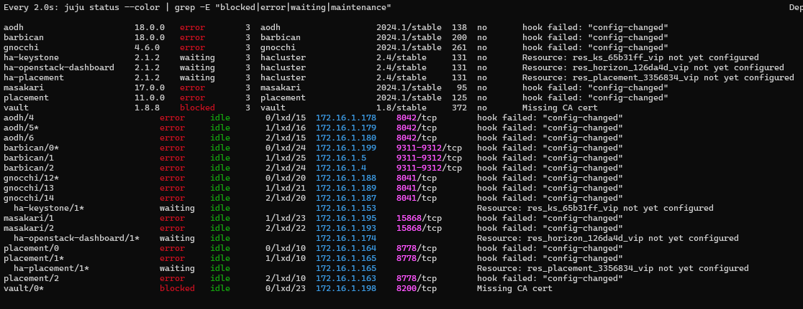

Resolve Hook Errors

```bash
juju resolve aodh/4 aodh/5 aodh/6 \
  barbican/0 barbican/1 barbican/2 \
  gnocchi/12 gnocchi/13 gnocchi/14 \
  masakari/0 masakari/1 masakari/2 \
  placement/0 placement/1 placement/2
```

:::warning
Tunggu hingga output kosong (tidak ada blocked/error). Biasanya 3-5 menit.
:::

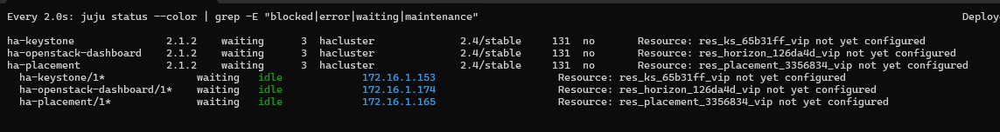

:::note
Next step: keystone, openstack-dashboard, placement.
:::

```bash
# Restart corosync dan pacemaker di keystone/4
juju ssh keystone/4 'sudo systemctl restart corosync && sleep 5 && sudo systemctl restart pacemaker'

# Fix placement/1 dan openstack-dashboard/1
for unit in placement/1 openstack-dashboard/1; do
  echo "=== Fixing $unit ==="
  juju ssh $unit 'sudo systemctl restart corosync && sleep 5 && sudo systemctl restart pacemaker && sudo systemctl is-active corosync pacemaker' 2>/dev/null
  echo ""
done
```

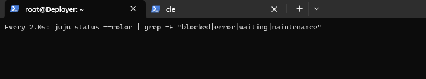

Verifikasi Sertifikat

```bash
# Misal salah satu service
juju ssh keystone/3 'sudo openssl x509 \
  -in /etc/apache2/ssl/keystone/cert_identity-api.projx.my.id \
  -noout -issuer -dates'

# Harus menunjukkan: issuer=C = US, O = Let's Encrypt, CN = E8
```

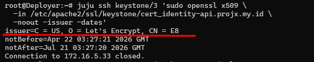

==Let's Encrypt Sudah Aktif di Keystone!==

### HTTPS Secure Horizon Dashboard

:::warning
Enable enforce-ssl dan SECURE_PROXY_SSL_HEADER
:::

```bash
# Enable enforce-ssl
juju config openstack-dashboard enforce-ssl=true
```

```bash
# Tunggu charm apply config
watch -n3 'juju status openstack-dashboard | grep -E "maintenance|active"'
```

```bash
# Verifikasi setelah apply
juju ssh openstack-dashboard/0 \
  'sudo grep -E "SECURE_PROXY|CSRF_COOKIE|SESSION_COOKIE" /etc/openstack-dashboard/local_settings.py'
```

```bash
# Restart apache semua unit horizon
for unit in openstack-dashboard/0 openstack-dashboard/1 openstack-dashboard/2; do
  juju ssh $unit 'sudo systemctl restart apache2' 2>/dev/null && echo "✅ $unit OK"
done
```

```bash
# Verifikasi
curl -v https://horizon-api.projx.my.id/auth/login/ \
  --cacert /root/openstack-ca/root-ca.pem -L 2>&1 | grep -E "HTTP|Location|< "
```

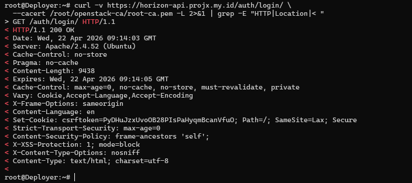

Verifikasi Dashboard

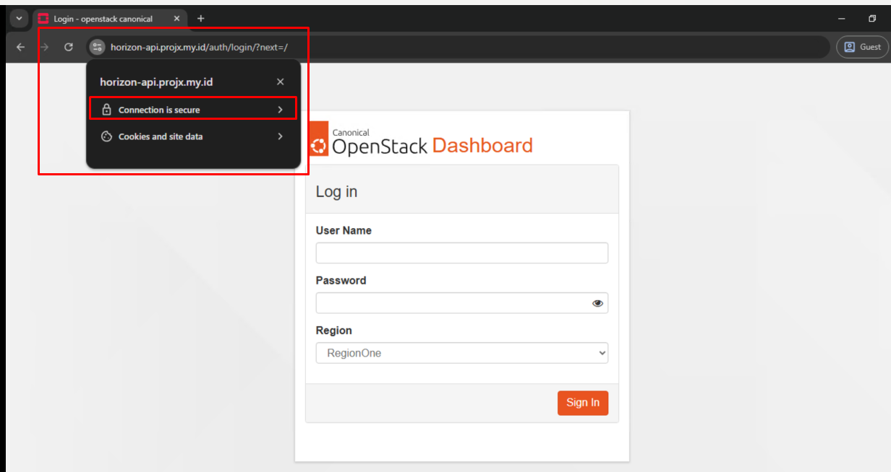

---

---

### Verifikasi Final Semua Services

```bash
openstack token issue
openstack service list
openstack endpoint list
```

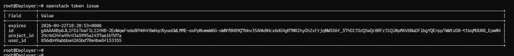

:::warning

:::

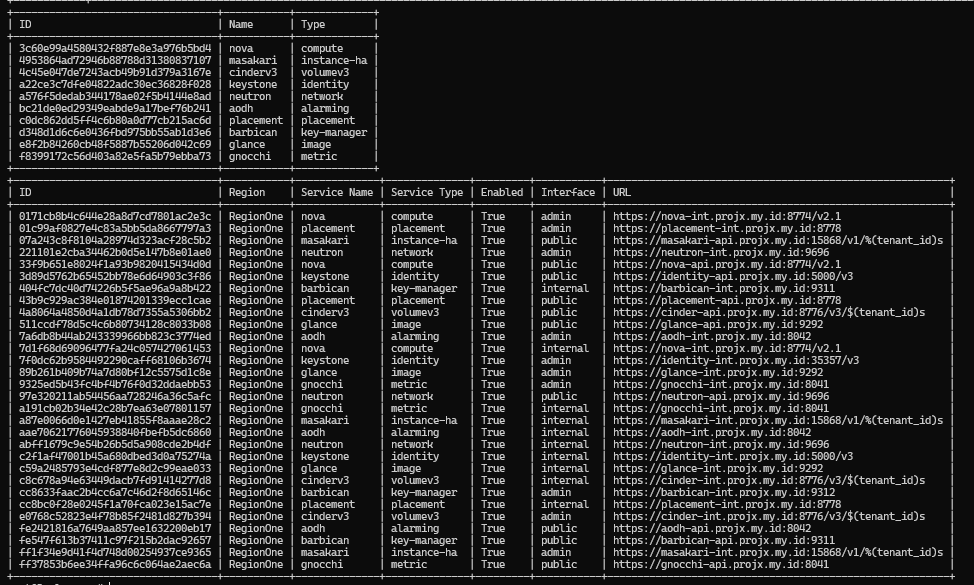

---

Verifikasi Masa aktif CA LE

```bash
echo "=== File Cert ===" 
openssl x509 -in /root/lego-work/certificates/_.projx.my.id.crt \
  -noout -subject -issuer -dates

echo ""
echo "=== Sisa Hari ===" 
expiry=$(openssl x509 -in /root/lego-work/certificates/_.projx.my.id.crt \
  -noout -enddate | cut -d= -f2)
expiry_epoch=$(date -d "$expiry" +%s)
now_epoch=$(date +%s)
days_left=$(( ($expiry_epoch - $now_epoch) / 86400 ))
echo "Cert expires: $expiry"
echo "Sisa: $days_left hari"
```

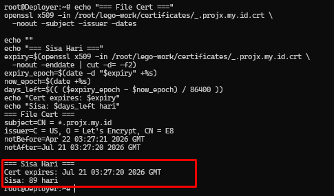

:::warning
Sertifikat masa aktif 90 Hari
:::

---

### Setup Auto-Renewal CA LE

:::warning
Ganti API TOKEN CLOUDFLARE= ““.
:::

```
# Pastikan CF_DNS_API_TOKEN tersimpan permanen
echo 'export CF_DNS_API_TOKEN="<GANTI-API-CLOUDFLARE>"' >> ~/.bashrc
source ~/.bashrc

# Buat script renewal
cat > /root/renew-le-cert.sh << 'EOF'
#!/bin/bash
set -e
LOG="/var/log/le-renewal.log"
echo "$(date): Starting renewal..." >> $LOG

source /root/.bashrc

CLOUDFLARE_DNS_API_TOKEN="${CF_DNS_API_TOKEN}" \
lego \
  --email unpwahyu@gmail.com \
  --dns cloudflare \
  --domains "*.projx.my.id" \
  --domains "projx.my.id" \
  --path /root/lego-work \
  --server https://acme-v02.api.letsencrypt.org/directory \
  renew --days 30

if [ $? -eq 0 ]; then
  cat /root/lego-work/certificates/_.projx.my.id.issuer.crt > /root/openstack-ca/root-ca.pem
  curl -s https://letsencrypt.org/certs/isrgrootx1.pem >> /root/openstack-ca/root-ca.pem

  SSL_CERT_B64="$(cat /root/lego-work/certificates/_.projx.my.id.crt | base64 -w0)"
  SSL_KEY_B64="$(cat /root/lego-work/certificates/_.projx.my.id.key | base64 -w0)"
  SSL_CA_B64="$(cat /root/lego-work/certificates/_.projx.my.id.issuer.crt | base64 -w0)"

  for app in keystone nova-cloud-controller cinder neutron-api glance \
             placement aodh barbican gnocchi masakari openstack-dashboard; do
    juju config $app \
      ssl_cert="${SSL_CERT_B64}" \
      ssl_key="${SSL_KEY_B64}" \
      ssl_ca="${SSL_CA_B64}"
    echo "$(date): Updated $app" >> $LOG
  done
  echo "$(date): Renewal completed!" >> $LOG
fi
EOF

chmod +x /root/renew-le-cert.sh

# Setup cron setiap tanggal 1 jam 02:00
(crontab -l 2>/dev/null; echo "0 2 1 * * /root/renew-le-cert.sh") | crontab -
crontab -l
```

:::info
Auto-renewal akan berjalan otomatis tiap tanggal 1 jika sisa < 30 hari.
:::